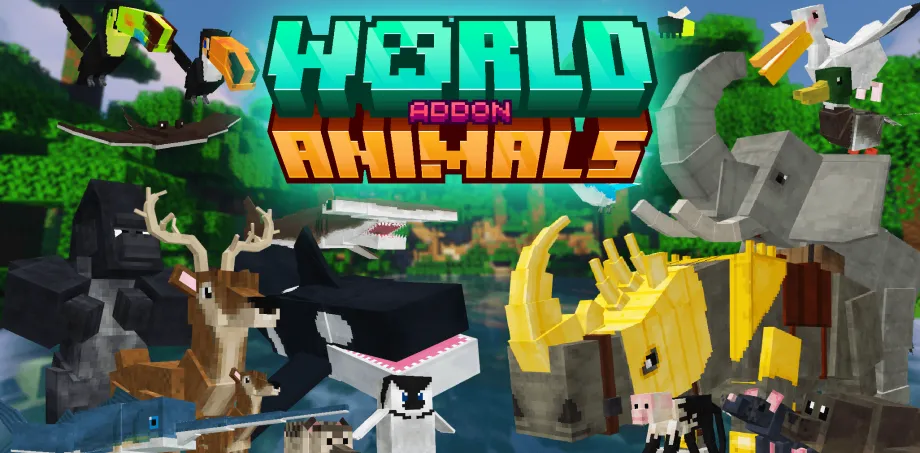

# World Animals Minecraft Bedrock Addon



Welcome to the comprehensive documentation for the **World Animals** addon for Minecraft Bedrock Edition! This addon brings over 70 real-world animals to your Bedrock world, featuring 1.21.20+ compatibility and stunning remastered content.

Originally created by **ArathNido**, this addon has been remastered for modern Bedrock versions with improved stability and no need for Holiday Creator Features.

## What's Inside

Explore a diverse ecosystem of animals across multiple biomes:

- **70+ Real-World Animals** including mammals, reptiles, amphibians, birds, and aquatic creatures
- **Tameable Companions** with saddles, armor, and equipment customization
- **Unique Mechanics** like DNA transformation, egg hatching, and breeding systems
- **Custom Items & Crafting** including weapons, armor sets, and cosmetics
- **World Generation Features** with new ores, plants, and special NPCs

## Table of Contents

- [Getting Started](getting-started.md) - Learn taming, breeding, and egg mechanics
- [Tameable Animals](animals-tameable.md) - Complete guide to all rideable and tameable creatures
- [Wild Animals](animals-wild.md) - Information about passive, neutral, and hostile animals
- [Items & Crafting](items-and-crafting.md) - Recipe guide for all custom items and equipment
- [World Generation](world-generation.md) - New ores, plants, and special locations
- [Special Mechanics](special-mechanics.md) - Advanced features like DNA transformation and unique drops

## Installation

### Requirements
- **Minecraft Bedrock Edition** 1.21.20 or higher
- **.mcaddon** file format support

### Installation Steps

1. **Download** the World Animals addon (.mcaddon file)
2. **Open** the .mcaddon file with Minecraft
3. **Enable** both the resource pack and behavior pack:
   - Accept the resource pack (textures and models)
   - Accept the behavior pack (game mechanics and animals)
4. **Create** or open a world with the packs enabled
5. **Play!** Animals will spawn naturally in appropriate biomes

> **Note:** Holiday Creator Features are **NOT required**. This remaster uses stable Minecraft Bedrock APIs for maximum compatibility.

## Updating an Existing World

If you previously used an older version of World Animals (v1.x), your existing worlds will need a one-time entity refresh. This is because Minecraft Bedrock caches entity data when they spawn — animals that already exist in your world will keep their old (broken) definitions until they are re-created.

### How to Refresh

After installing the updated addon on an existing world, open the chat and run:

```
/scriptevent worldanimals:refresh
```

This command will:
1. Find all World Animals entities across all dimensions
2. Save their state (tamed status, name tags, saddles, armor, tags)
3. Remove the old entities
4. Spawn fresh replacements with the updated definitions
5. Restore their saved state (tamed animals stay tamed, equipped armor is re-applied)

You'll see a message confirming how many entities were refreshed.

### Alternative: Full Despawn

If you prefer to start fresh and let animals respawn naturally:

```
/scriptevent worldanimals:despawnall
```

This removes all World Animals entities without replacing them. New animals will spawn naturally as you explore.

> **New worlds** do not need either command — animals will spawn with the correct definitions automatically.

## Quick Start Guide

### Taming Animals

The **Golden Bone** is the universal taming item for most animals:

1. Craft a Golden Bone using the recipe on [Getting Started](getting-started.md)
2. Right-click/interact with a tameable animal while holding the Golden Bone
3. Watch for heart particles to indicate successful taming
4. Interact again to ride or use equipment

### Breeding

1. Tame two animals of the same species
2. Feed them their preferred food item
3. Hearts will appear and a baby animal will spawn
4. Use **Gold Bone Meal** to accelerate growth

### Eggs

Some animals lay eggs or can be bred to produce eggs:

1. Place the egg on solid ground
2. Wait for it to hatch naturally (takes time)
3. Use **Gold Bone Meal** to speed up hatching
4. A baby animal will spawn when ready

## Features Highlight

### Diverse Biomes
Animals spawn in appropriate biomes - deserts, jungles, forests, oceans, snow biomes, and more.

### Tameable System
Domesticate and ride over 40 different animals with custom saddles and armor protection.

### DNA Transformation
Transform tamed Elephants into Mammoths using special DNA syringes and crafting recipes.

### Custom Weapons & Tools
Craft unique weapons from animal materials - shark swords, pearl swords, and more.

### World Customization
New ores (Ruby and Citrine), special trees (Palm Trees), and traders (Safari and Ice Villagers).

### Cosmetic Customization
Equip animals with scarves, hats, flags, armor, and special suits for unique styling.

## Support

For questions, issues, or feedback about this documentation, please refer to the specific page relevant to your question. Each documentation page provides detailed information about its topic.

---

**Started:** Originally created by ArathNido
**Remastered for:** Minecraft Bedrock 1.21.20+
**Last Updated:** 2026
