# Tameable Animals

This page covers all animals that can be tamed and ridden in the World Animals addon. Each animal has unique characteristics, preferred foods, and equipment options.

## Elephants & Mammoth

### Overview

The largest land animals in the addon, Elephants are powerful mounts with armor options and special DNA transformation capabilities.

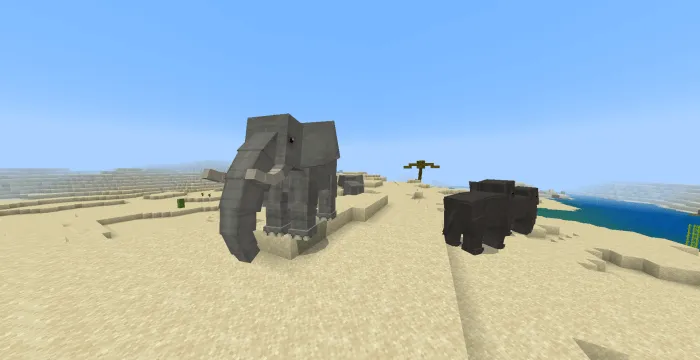

### African Elephant

- **Biomes:** Savanna, grasslands
- **Health:** 80 HP
- **Damage:** 12
- **Food:** Sugar Cubes, hay bales
- **Equipment:** Saddle, armor (see recipes below)
- **Special Ability:** Can be transformed into a Mammoth using DNA syringe
- **Drops:** Elephant DNA, tusks

### Asian Elephant

- **Biomes:** Jungle, tropical regions
- **Health:** 75 HP
- **Damage:** 11
- **Food:** Sugar Cubes, bananas
- **Equipment:** Saddle, armor
- **Special Ability:** Can be transformed into a Mammoth
- **Drops:** Elephant DNA, tusks

### Mammoth

The transformed version of Elephants, created through DNA manipulation.

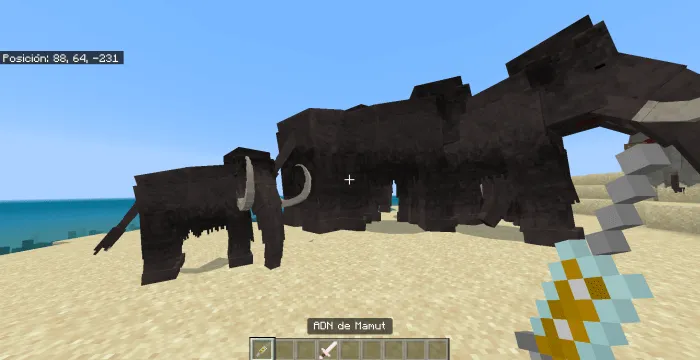

- **How to Create:** Use DNA Syringe on a tamed Elephant
- **Health:** 150 HP (increased from base Elephant)
- **Damage:** 20 (increased)
- **Food:** Sugar Cubes, ice
- **Equipment:** Saddle, armor
- **Biomes:** Snow biomes, tundra
- **Drops:** Mammoth DNA, tusks, fur

#### Elephant Saddle Recipe

**Crafted with:**
- Leather
- Gold ingots
- Saddle components

**Result:** Elephant Saddle (allows riding)

### Elephant Armor

Elephants can wear 9 different armor variants for cosmetic and protective purposes.

Armor provides protection while adding visual customization to your mount. Choose from colored leather, gold-trimmed, and decorative designs.

---

## Big Cats

### Overview

A diverse family of large felines, all tameable and rideable with custom saddles. Big cats include lions, tigers, leopards, and more.

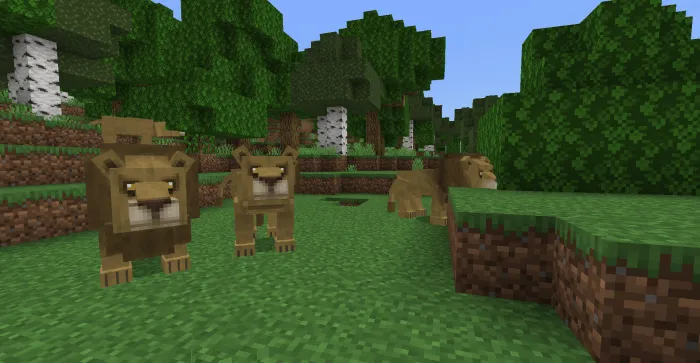

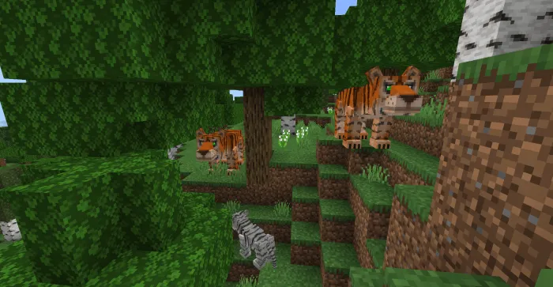

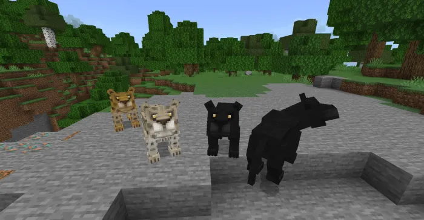

### Lion

- **Biomes:** Savanna, grasslands
- **Health:** 20 HP
- **Damage:** 8
- **Food:** Raw meat, cooked meat, fish
- **Equipment:** Big Cat Saddle
- **Drops:** Feline Tooth, raw meat
- **Behavior:** Naturally spawns in prides

### White Lion

- **Biomes:** Savanna (rare)
- **Health:** 20 HP
- **Damage:** 8
- **Food:** Raw meat, cooked meat
- **Equipment:** Big Cat Saddle
- **Drops:** Feline Tooth, white fur
- **Behavior:** Rare color variant

### Tiger

- **Biomes:** Jungle, dark forests
- **Health:** 22 HP
- **Damage:** 9
- **Food:** Raw meat, fish
- **Equipment:** Big Cat Saddle
- **Drops:** Feline Tooth, striped fur
- **Behavior:** Solitary hunters

### White Tiger

- **Biomes:** Jungle (very rare)
- **Health:** 22 HP
- **Damage:** 9
- **Food:** Raw meat, fish
- **Equipment:** Big Cat Saddle
- **Drops:** Feline Tooth, white fur
- **Behavior:** Extremely rare variant

### Leopard

- **Biomes:** Dark forests, jungles
- **Health:** 18 HP
- **Damage:** 7
- **Food:** Raw meat, fish
- **Equipment:** Big Cat Saddle
- **Drops:** Feline Tooth, spotted fur

### Snow Leopard

- **Biomes:** Snow mountains, cold areas
- **Health:** 18 HP
- **Damage:** 7
- **Food:** Raw meat, fish
- **Equipment:** Big Cat Saddle
- **Drops:** Feline Tooth, white fur
- **Behavior:** Adapted to snow biomes

### Panther

- **Biomes:** Dark forests, jungles
- **Health:** 19 HP
- **Damage:** 8
- **Food:** Raw meat, fish
- **Equipment:** Big Cat Saddle
- **Drops:** Feline Tooth, black fur

### Cougar

- **Biomes:** Mountains, forests
- **Health:** 19 HP
- **Damage:** 8
- **Food:** Raw meat, fish
- **Equipment:** Big Cat Saddle
- **Drops:** Feline Tooth, tan fur

### Big Cat Saddle Recipe

**Crafted with:**
- Leather
- Copper ingots
- String

**Result:** Big Cat Saddle (allows riding and control)

---

## Rhinoceros

Powerful armored herbivores with up to 8 armor tiers, each increasing health and damage significantly.

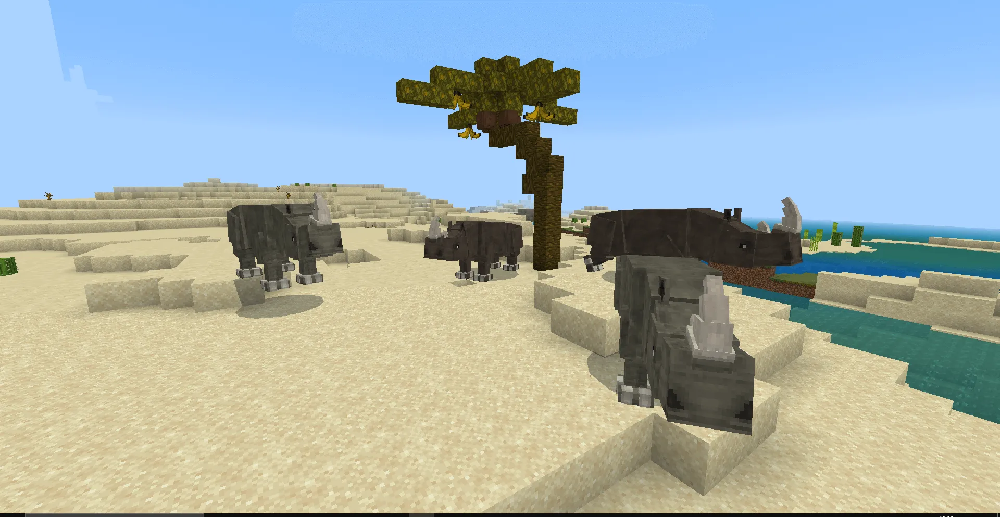

### Base Stats

- **Biomes:** Savanna, grasslands
- **Health:** 50 HP (base, increases with armor)
- **Damage:** 9 (base, increases with armor)
- **Food:** Hay bales, vegetables
- **Behavior:** Herd animals, aggressive when provoked

### Rhino Armor Tiers

| Tier | Health | Damage | Material |
|------|--------|--------|----------|
| 1 | 60 | 12 | Leather |
| 2 | 80 | 15 | Iron |
| 3 | 100 | 18 | Gold |
| 4 | 120 | 21 | Copper |
| 5 | 140 | 24 | Netherite |
| 6 | 160 | 27 | Diamond |
| 7 | 180 | 29 | Emerald |
| 8 | 200 | 30 | Platinum |

Each armor tier provides substantial protection and offensive capability upgrades. Stack multiple armor layers for maximum effect.

---

## Giraffe

The tallest land animal in the addon, with unique saddle that includes chest storage.

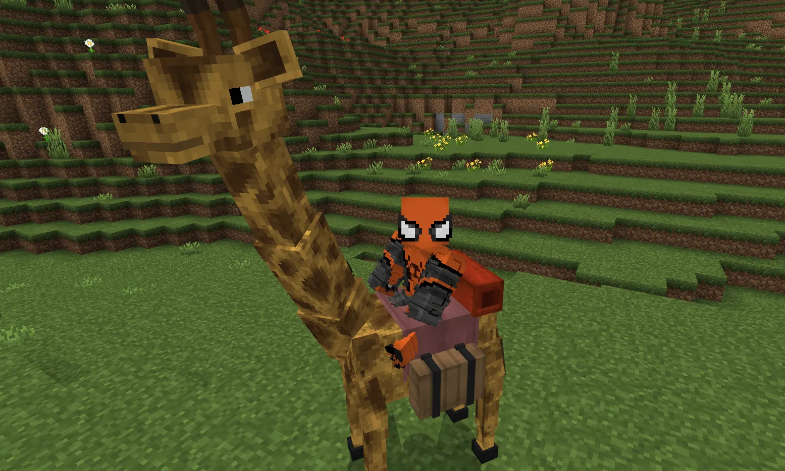

- **Biomes:** Savanna, grasslands
- **Health:** 30 HP
- **Damage:** 4 (gentle creature)
- **Food:** Acacia leaves, hay, tall grass
- **Equipment:** Giraffe Saddle (includes storage chest)
- **Drops:** Giraffe hide, leaves
- **Special Feature:** Built-in chest for inventory storage
- **Height:** Tallest animal mount, unique perspective

---

## Ostrich

Fast runners with saddle, armor, and flag decorations. Ostriches lay eggs for breeding.

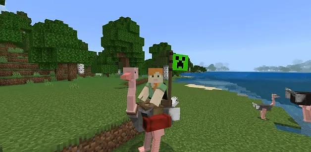

- **Biomes:** Desert, savanna
- **Health:** 20 HP
- **Damage:** 5
- **Food:** Seeds, hay, vegetables
- **Equipment:** Saddle, armor, flags (5 colors)
- **Special Feature:** Fast runner, lays eggs
- **Drops:** Raw ostrich legs, feathers, eggs
- **Breeding:** Produces eggs that can be hatched with Golden Bone or Gold Bone Meal

### Ostrich Saddle

Allows riding and control of Ostriches, optimized for their fast running.

### Ostrich Flags

Decorate your Ostrich with colorful flags in 5 different colors for cosmetic customization.

---

## Gorilla

Powerful jungle dwellers with unique dietary preferences.

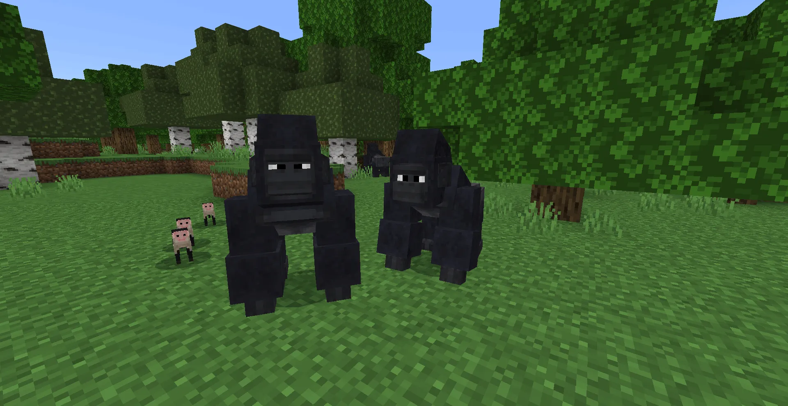

- **Biomes:** Jungle (dense forests only)
- **Health:** 35 HP
- **Damage:** 12
- **Food:** Bananas, melons, fruits
- **Equipment:** Saddle (if applicable)
- **Drops:** Gorilla fur, raw meat
- **Behavior:** Solitary or small groups, aggressive if provoked
- **Special:** Prefers jungle fruits over standard Golden Bone taming

---

## Komodo Dragon

Large reptiles with poison damage capability.

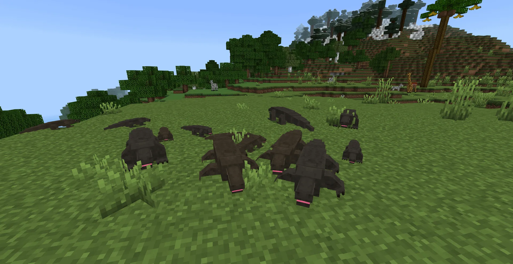

- **Biomes:** Tropical islands, hot biomes
- **Health:** 40 HP
- **Damage:** 10 (plus poison effect)
- **Food:** Raw meat, fish
- **Equipment:** Saddle, reptile armor
- **Drops:** Reptile skin, poison gland
- **Special:** Poison damage on attacks
- **Behavior:** Solitary hunters, territorial

---

## Penguins

Aquatic flightless birds with 4 color variants. Can wear scarves for cosmetic customization.

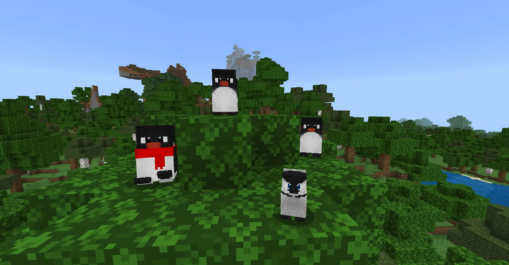

- **Biomes:** Snow, ice, cold ocean biomes
- **Health:** 15 HP per variant
- **Damage:** 3
- **Food:** Fish, raw fish
- **Equipment:** Scarves (16 color variants)
- **Drops:** Feathers, penguin skin
- **Special Ability:** Swim underwater efficiently
- **Variants:** 4 different color patterns

### Penguin Scarves

Decorate your penguins with colorful scarves in 16 different colors! Purely cosmetic but adds personality to your aquatic companion.

---

## Caracal

Small cats with large ears, can wear decorative scarves.

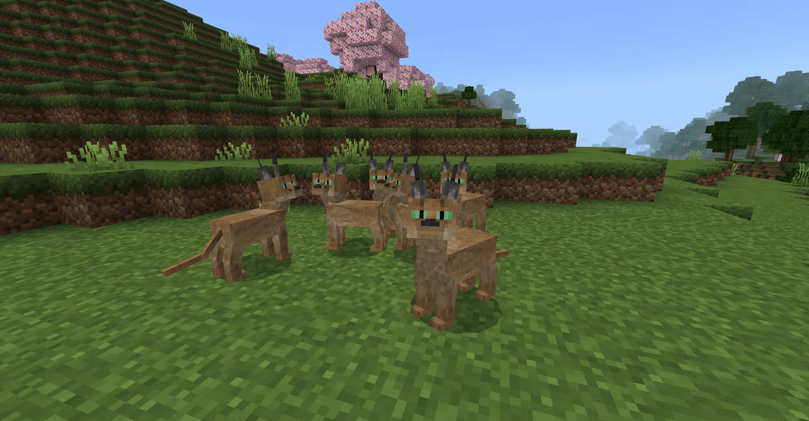

- **Biomes:** Desert, savanna, grasslands
- **Health:** 12 HP
- **Damage:** 4
- **Food:** Raw meat, fish
- **Equipment:** Scarves (16 color variants)
- **Drops:** Feline tooth, fur
- **Special:** Fast runner for a small cat
- **Behavior:** Curious and agile

---

## Seal

Aquatic mammals adapted to frozen environments.

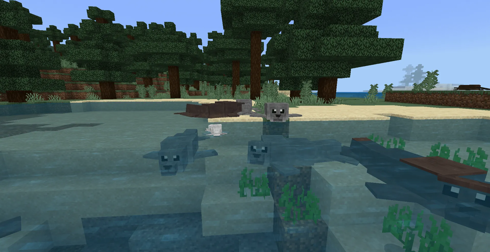

- **Biomes:** Frozen oceans, ice biomes
- **Health:** 18 HP
- **Damage:** 5
- **Food:** Fish, raw fish
- **Equipment:** Scarves (if compatible)
- **Drops:** Fur, fish
- **Special:** Excellent swimmers
- **Behavior:** Social, often found in groups

---

## Hedgehog (Erizo)

Small spiky mammals that can wear hats.

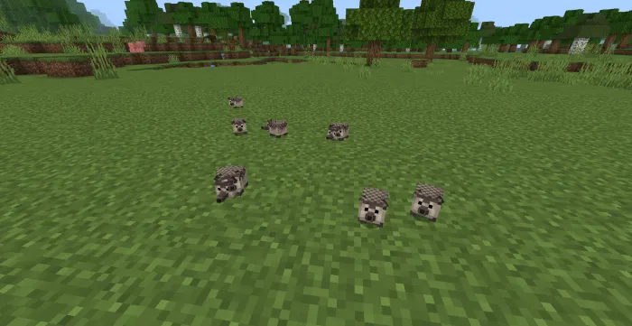

- **Biomes:** Temperate forests, grasslands
- **Health:** 8 HP
- **Damage:** 2
- **Food:** Seeds, insects, small items
- **Equipment:** Hat
- **Drops:** Spines, fur
- **Special:** Small and cute, great for decoration
- **Behavior:** Curls up when threatened

---

## Platypus

Unique egg-laying mammal that can wear hats.

- **Biomes:** Rivers, water areas in temperate zones
- **Health:** 12 HP
- **Damage:** 3
- **Food:** Small fish, insects
- **Equipment:** Hat
- **Drops:** Fur, eggs
- **Special:** Lays eggs for breeding
- **Behavior:** Semi-aquatic, appears near water

---

## Chimpanzee

Intelligent primates that can wear astronaut suits.

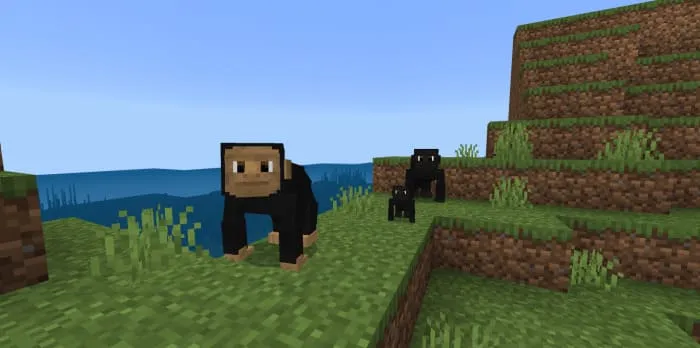

- **Biomes:** Jungle, tropical regions
- **Health:** 28 HP
- **Damage:** 7
- **Food:** Fruits, vegetables, bananas
- **Equipment:** Astronaut suits (4 colors), scarves
- **Drops:** Fur, raw meat
- **Special:** Can be dressed in astronaut suits for unique cosmetic
- **Behavior:** Social, intelligent

---

## Capuchin Monkey

Small agile primates native to jungles.

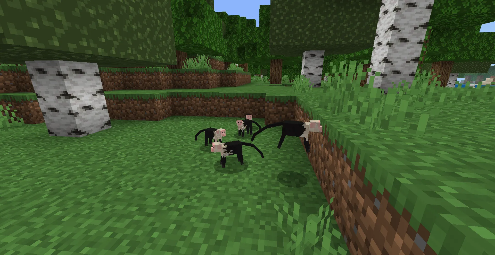

- **Biomes:** Jungle, tropical rainforests
- **Health:** 10 HP
- **Damage:** 2
- **Food:** Fruits, bananas, nuts
- **Equipment:** Limited equipment
- **Drops:** Fur, small items
- **Special:** Agile and quick
- **Behavior:** Social, active

---

## Red Panda

Small adorable mammals with red and black coloring.

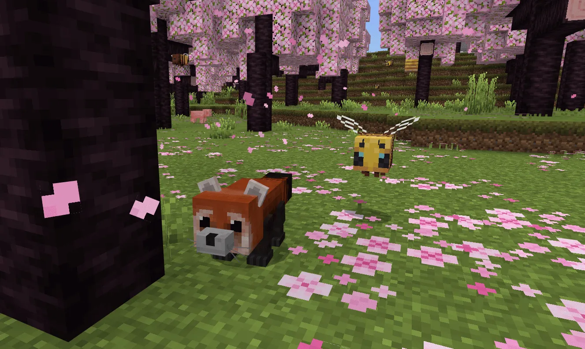

- **Biomes:** Bamboo forests, temperate forests
- **Health:** 10 HP
- **Damage:** 2
- **Food:** Bamboo, fruits, insects
- **Equipment:** Scarves
- **Drops:** Fur, small items
- **Special:** Cute appearance, non-threatening
- **Behavior:** Peaceful, enjoys climbing

---

## Raccoon

Nocturnal foragers with distinctive masks.

- **Biomes:** Forests, wetlands
- **Health:** 8 HP
- **Damage:** 2
- **Food:** Seeds, small items, vegetables
- **Equipment:** Scarves
- **Drops:** Fur, small items
- **Special:** Nocturnal behavior
- **Behavior:** Curious and mischievous

---

## Rat (Multiple Colors)

Small rodents with several color variants. Provide special food recipes.

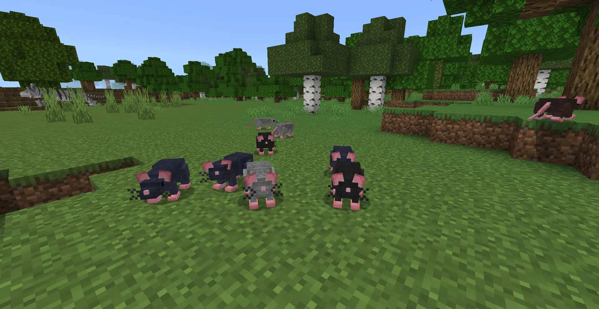

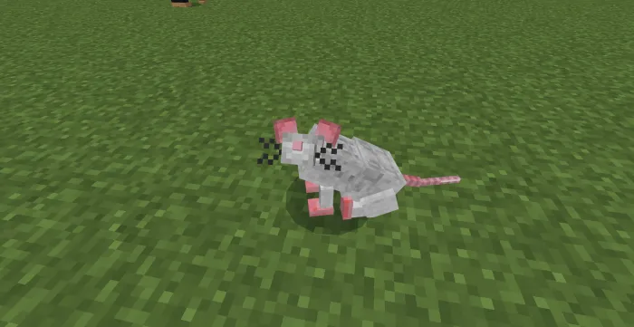

- **Biomes:** All biomes (sewers, caves, buildings)
- **Health:** 4 HP
- **Damage:** 1
- **Food:** Seeds, cheese, small items
- **Equipment:** None
- **Drops:** Rat meat, tail
- **Special:** Can be cooked into food items
- **Variants:** Multiple color options
- **Food Items:** Rats can be cooked or made into tacos

---

## Kiwi

Flightless birds with long beaks, native to specific biomes.

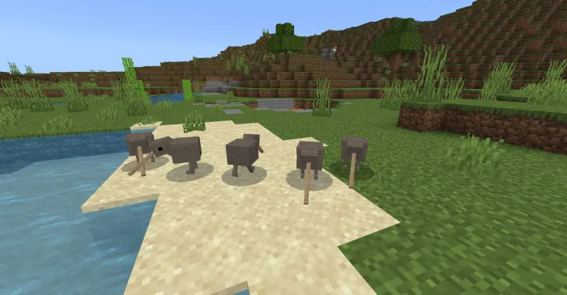

- **Biomes:** Temperate forests, grasslands
- **Health:** 10 HP
- **Damage:** 2
- **Food:** Seeds, small insects, worms
- **Equipment:** None typically
- **Drops:** Feathers, eggs
- **Special:** Flightless bird
- **Behavior:** Ground-dwelling, shy

---

## Toucan

Colorful tropical birds with distinctive large beaks.

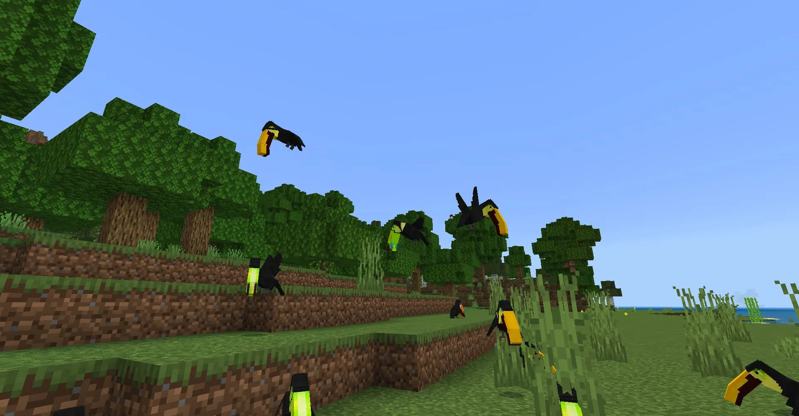

- **Biomes:** Jungle, tropical rainforests
- **Health:** 8 HP
- **Damage:** 1
- **Food:** Fruits, seeds, berries
- **Equipment:** None
- **Drops:** Feathers, colorful feathers
- **Special:** Bright coloring, tropical appearance
- **Behavior:** Social, vocal

---

## Land Turtle

Reptiles that move slowly but are peaceful herbivores.

- **Biomes:** Grasslands, tropical areas
- **Health:** 12 HP
- **Damage:** 1
- **Food:** Vegetables, fruits, hay
- **Equipment:** None
- **Drops:** Shell pieces, meat
- **Special:** Slow movement but tank-like durability
- **Behavior:** Peaceful, grazing

---

## Iguana

Large tropical reptiles with distinctive crests.

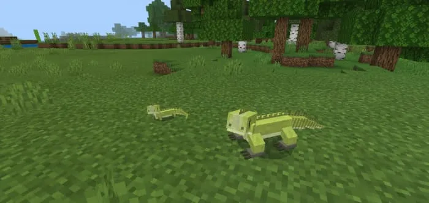

- **Biomes:** Jungle, tropical regions
- **Health:** 15 HP
- **Damage:** 4
- **Food:** Fruits, vegetables, leaves
- **Equipment:** Reptile armor
- **Drops:** Reptile skin, meat
- **Special:** Tree-dwelling behavior
- **Behavior:** Solitary, territorial

---

## Scarlet Kingsnake

Venomous snakes with distinctive red and yellow banding.

- **Biomes:** Swamps, grasslands
- **Health:** 10 HP
- **Damage:** 5 (venomous)
- **Food:** Small creatures, eggs
- **Equipment:** None
- **Drops:** Venom sac, scales
- **Special:** Venomous bite
- **Behavior:** Solitary, nocturnal

---

[Back to Main Documentation](README.md)
