# Wild Animals

This page covers all non-tameable wild animals in the World Animals addon. These creatures range from peaceful herbivores to dangerous predators, adding diversity and challenge to your world.

## Passive Animals

These animals are peaceful and won't attack under normal circumstances.

### Deer

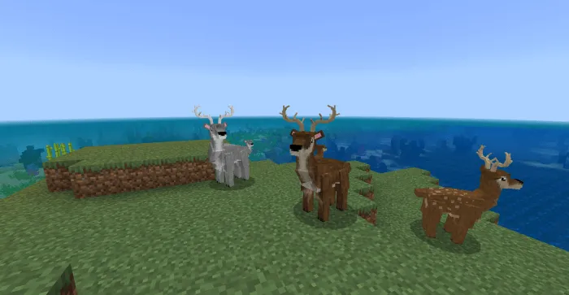

- **Biomes:** Forests, grasslands, meadows
- **Health:** 12 HP
- **Behavior:** Flee from players, travel in herds
- **Drops:** Venison, hide
- **Special:** Fast runners when startled
- **Appearance:** Various brown colorations

### Zebra

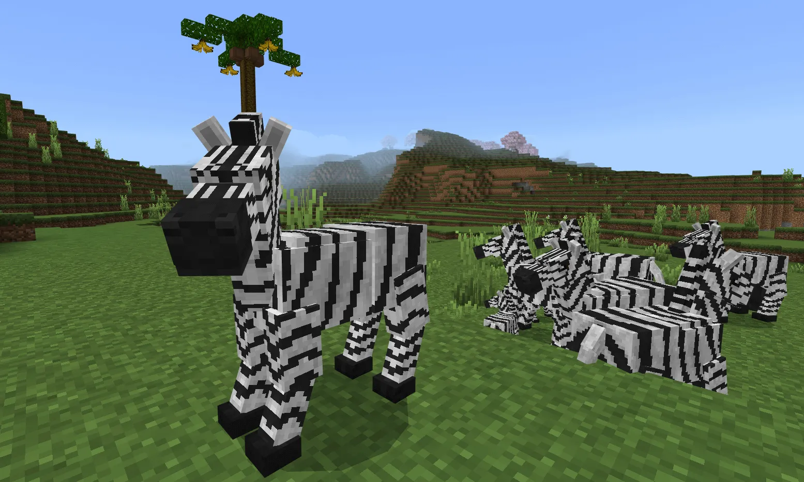

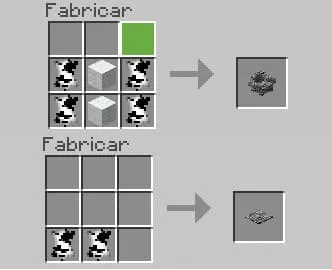

- **Biomes:** Savanna, grasslands
- **Health:** 25 HP
- **Behavior:** Travel in herds, flee from threats
- **Drops:** Zebra skin, raw meat
- **Special:** Distinctive stripes, can be used for decorative items (carpets, sofas)
- **Notable:** Materials used for unique zebra-themed furniture

### Flamingo

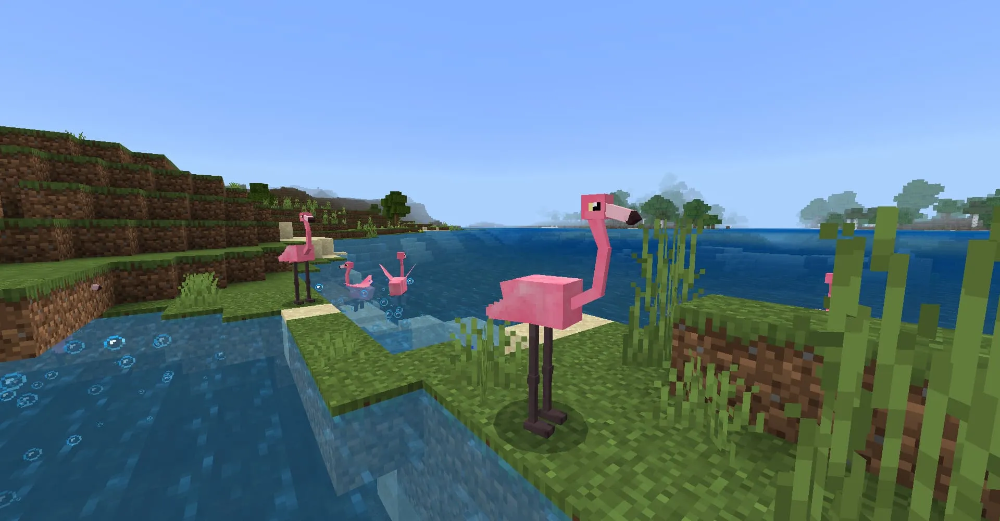

- **Biomes:** Tropical swamps, beaches, warm waters
- **Health:** 8 HP
- **Behavior:** Wading birds, peaceful
- **Drops:** Feathers, colorful feathers
- **Special:** Pink coloring, stands on one leg
- **Appearance:** Iconic pink plumage

### Duck

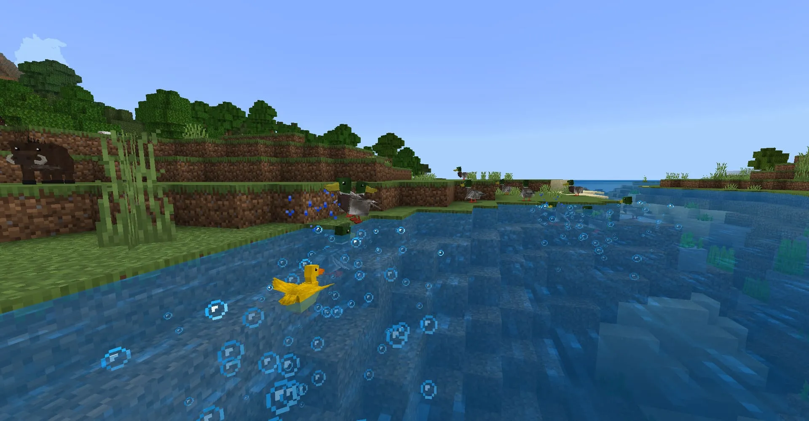

- **Biomes:** Lakes, rivers, water biomes
- **Health:** 6 HP
- **Behavior:** Swim peacefully, waddle on land
- **Drops:** Raw duck meat, feathers, eggs
- **Food Item:** Can be cooked into food
- **Special:** Aquatic birds, lays eggs
- **Appearance:** Waterfowl with typical duck coloring

### Snail

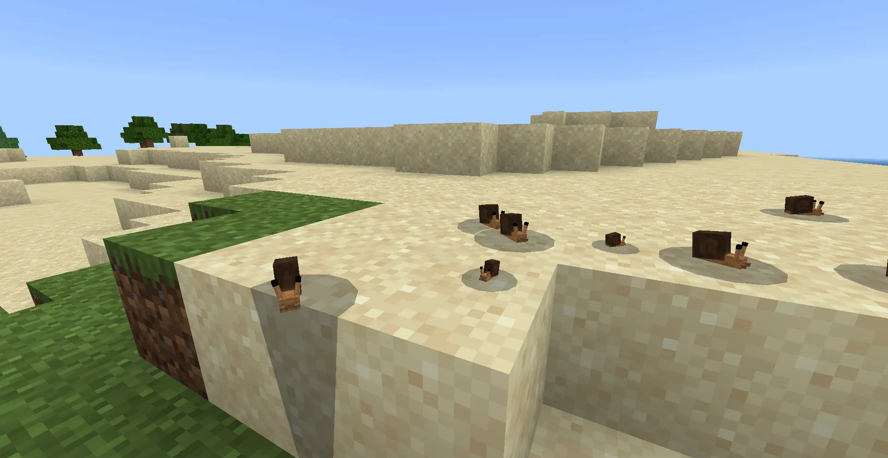

- **Biomes:** Swamps, wet areas
- **Health:** 2 HP (very fragile)
- **Behavior:** Slowly move around, hide in shells
- **Drops:** Slime, shell fragments
- **Special:** Extremely slow movement
- **Appearance:** Gastropod with visible shell

### Squirrel

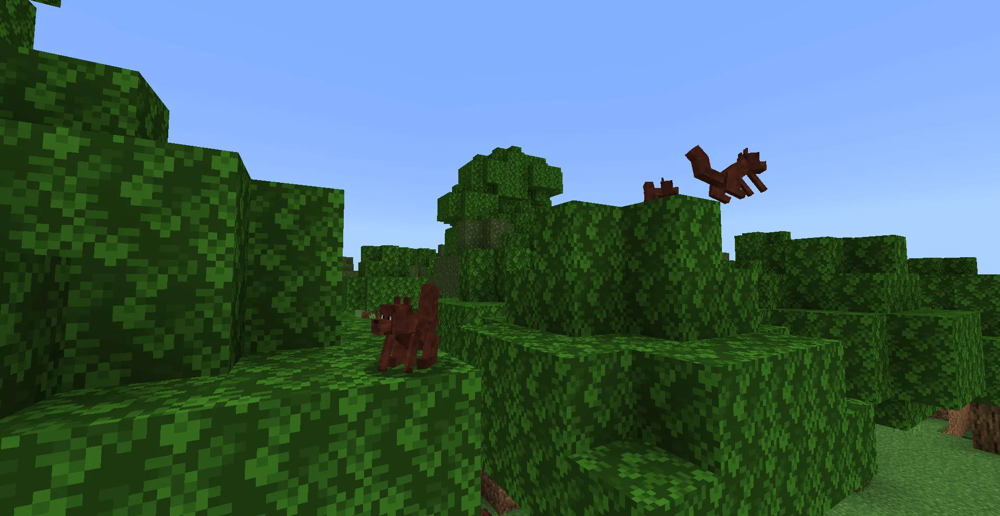

- **Biomes:** Forests, temperate woodlands
- **Health:** 4 HP
- **Behavior:** Climb trees, store nuts, agile
- **Drops:** Nuts, seeds, small items
- **Special:** Tree-dwelling behavior
- **Appearance:** Small fluffy rodents with bushy tails

### Buffalo

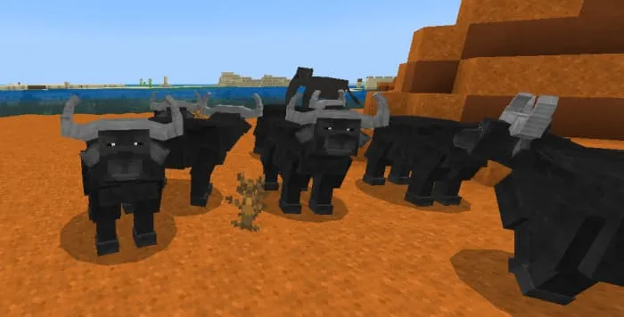

- **Biomes:** Grasslands, savannas, plains
- **Health:** 35 HP
- **Behavior:** Herd animals, peaceful unless provoked
- **Drops:** Hide, raw meat, horns
- **Special:** Large horned herbivores
- **Appearance:** Dark massive bovines

### Butterfly

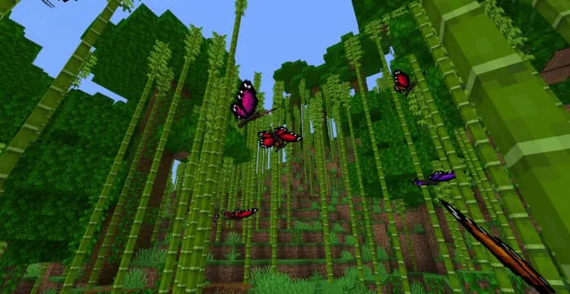

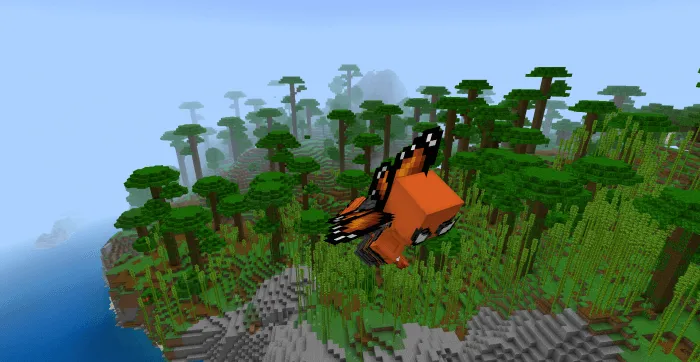

- **Biomes:** All biomes with flowers
- **Health:** 2 HP
- **Behavior:** Flutter around flowers, peaceful
- **Drops:** Butterfly wings (craftable into elytra)
- **Special:** Can be crafted into colorful elytra wings (5 colors)
- **Appearance:** Colorful winged insects

### Firefly

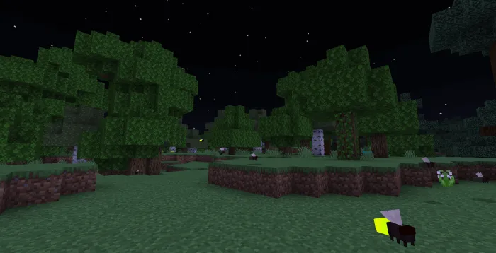

- **Biomes:** Forests, swamps at night
- **Health:** 1 HP
- **Behavior:** Glow at night, peaceful
- **Drops:** Glowing essence, light particles
- **Special:** Emit light particles
- **Appearance:** Bioluminescent insects
- **Note:** Typo in image filename: "flreflies"

### Seagull

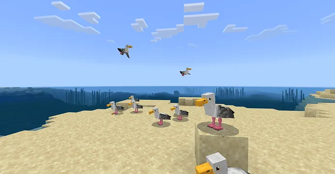

- **Biomes:** Beaches, coastal areas, ocean
- **Health:** 6 HP
- **Behavior:** Fly around beaches, search for food
- **Drops:** Feathers, small items
- **Special:** Coastal birds
- **Appearance:** White and gray seabirds

### Pigeon

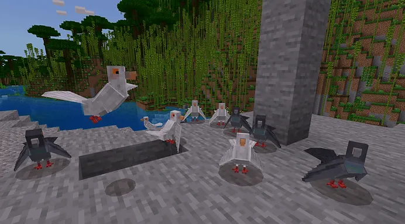

- **Biomes:** Villages, urban areas, forests
- **Health:** 6 HP
- **Behavior:** Coo sounds, peck at ground
- **Drops:** Feathers, small items
- **Special:** Can carry items in bags (drop coordination)
- **Appearance:** Gray and white birds

### Stork

- **Biomes:** Wetlands, marshes, open areas
- **Health:** 10 HP
- **Behavior:** Wade in water, peaceful
- **Drops:** Feathers, bag items
- **Special:** Long-legged wading birds
- **Appearance:** Black and white birds with long beaks

---

## Neutral Animals

These animals are generally peaceful but may attack if provoked or threatened.

### Bear / Black Bear

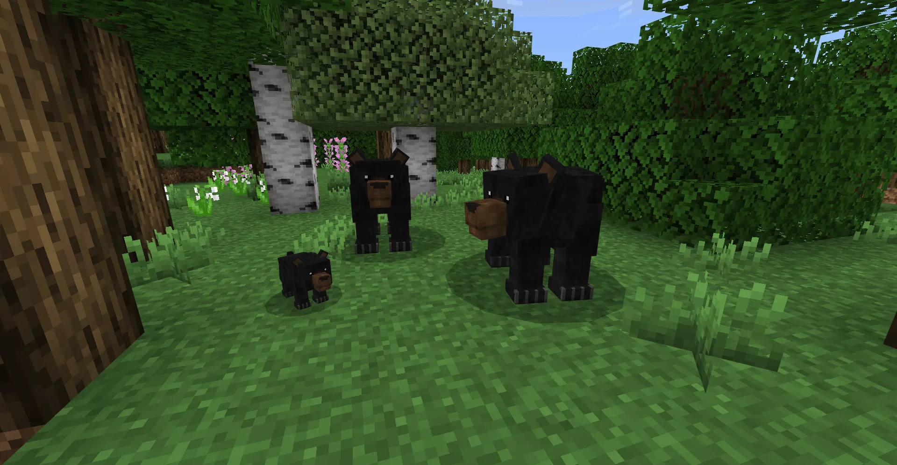

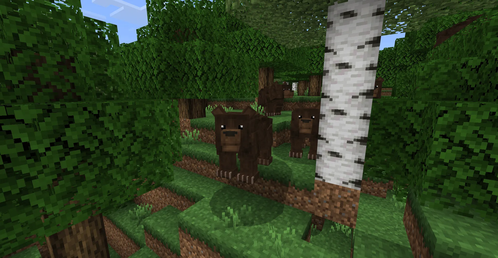

- **Biomes:** Forests, taiga, mountain forests
- **Health:** 40 HP
- **Damage:** 10
- **Behavior:** Forage peacefully, aggressive if approached with cubs or threatened
- **Drops:** Raw meat, hide, claws
- **Special:** Mother bears protect cubs
- **Variants:** Black bears and brown bears
- **Caution:** Keep distance from cubs to avoid aggression

### Hippopotamus

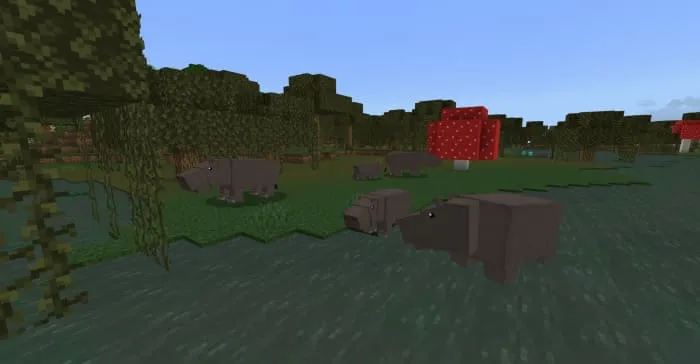

- **Biomes:** Rivers, swamps, water areas in hot biomes
- **Health:** 50 HP
- **Damage:** 12
- **Behavior:** Spend most time in water, territorial
- **Drops:** Raw meat, hide, tusks
- **Special:** Powerful jaws, dangerous in water
- **Caution:** Avoid getting too close in their water territory

### Kangaroo

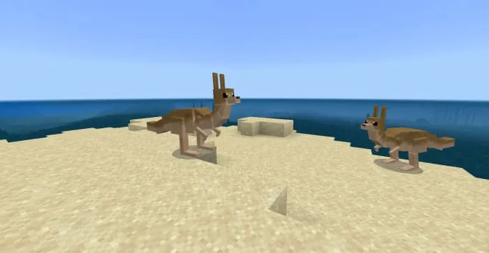

- **Biomes:** Grasslands, savannas, plains
- **Health:** 20 HP
- **Damage:** 6
- **Behavior:** Bounce around, flee if attacked
- **Drops:** Raw meat, hide
- **Special:** Powerful jumping ability
- **Appearance:** Iconic hopping marsupials

### Wild Boar

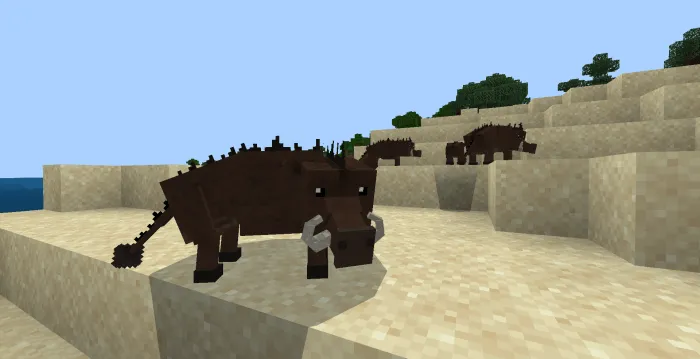

- **Biomes:** Forests, grasslands, dark oak forests
- **Health:** 25 HP
- **Damage:** 8
- **Behavior:** Forage on ground, aggressive if threatened
- **Drops:** Raw meat, hide, tusks
- **Special:** Tusks can be dangerous
- **Caution:** Don't provoke - they will charge

### Ant

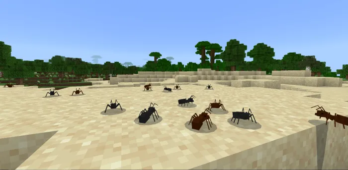

- **Biomes:** All biomes on ground
- **Health:** 1 HP (very fragile)
- **Damage:** Negligible
- **Behavior:** Swarm behavior, work in colonies
- **Drops:** Chitin, small items
- **Special:** Extremely small creatures
- **Appearance:** Tiny insects, easy to miss

---

## Hostile Animals

These animals are inherently aggressive and will attack on sight.

### Crocodile

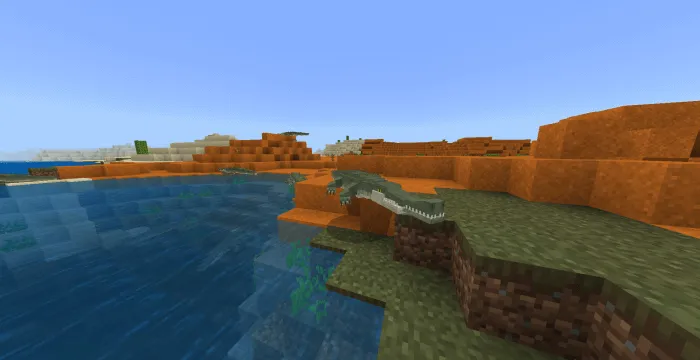

- **Biomes:** Swamps, rivers, tropical waters
- **Health:** 30 HP
- **Damage:** 8
- **Behavior:** Aggressive ambush predators
- **Drops:** Crocodile hide, teeth, raw meat
- **Special:** Can snap at players from water
- **Variant:** 10% chance to spawn as white variant
- **Caution:** Avoid water with crocodiles

### Hyena

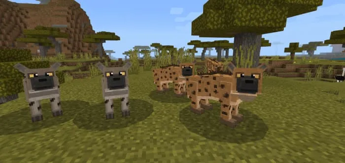

- **Biomes:** Savannas, grasslands, deserts
- **Health:** 18 HP
- **Damage:** 6
- **Behavior:** Hunt in packs, aggressive
- **Drops:** Raw meat, hide
- **Special:** Pack hunting behavior
- **Caution:** Dangerous in groups

### Shark (Blue Shark)

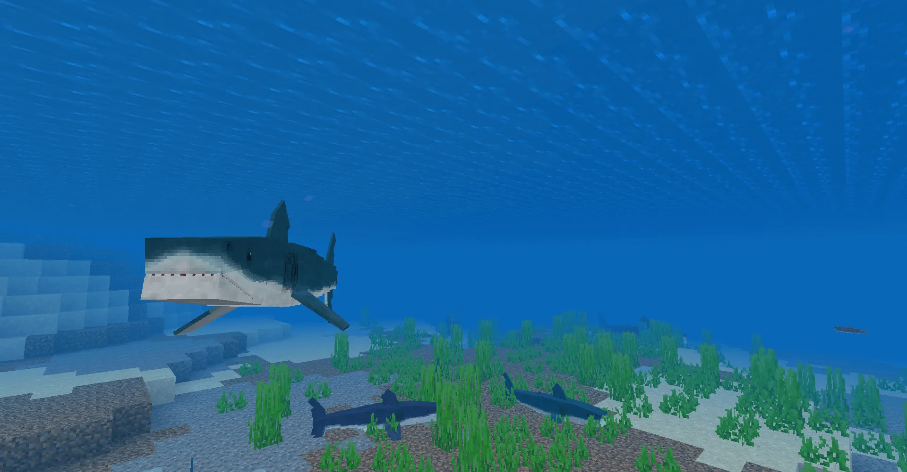

- **Biomes:** Ocean, deep water
- **Health:** 35 HP
- **Damage:** 10
- **Behavior:** Aggressive in water, hunt players
- **Drops:** Shark teeth, raw fish, meat
- **Special:** Can be crafted into weapons
- **Caution:** Extremely dangerous in water

### Shark (White Shark)

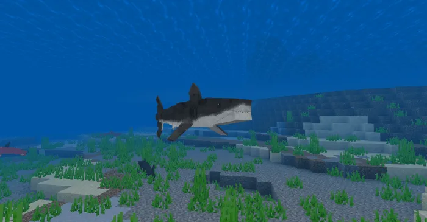

- **Biomes:** Ocean, deep water (rare)
- **Health:** 45 HP
- **Damage:** 12
- **Behavior:** Apex predator, very aggressive
- **Drops:** Shark teeth, raw fish, meat
- **Special:** Largest shark variant
- **Caution:** Lethal to unprepared players

### Shark (Tiger Shark)

- **Biomes:** Tropical ocean, warm waters
- **Health:** 38 HP
- **Damage:** 11
- **Behavior:** Aggressive, pack hunters
- **Drops:** Shark teeth, raw fish, meat
- **Special:** Tropical variant
- **Caution:** Often hunt in groups

### Shark Weapons

Sharks can drop teeth that are crafted into weapons. Additionally, Drowned can spawn with shark weapons naturally.

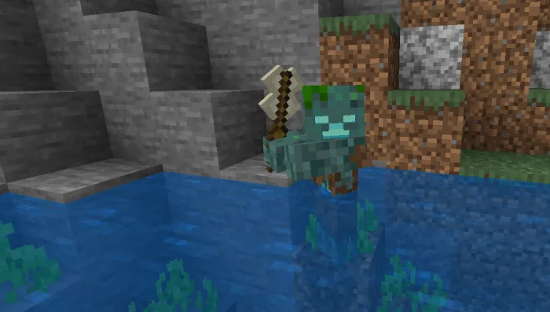

### Snake

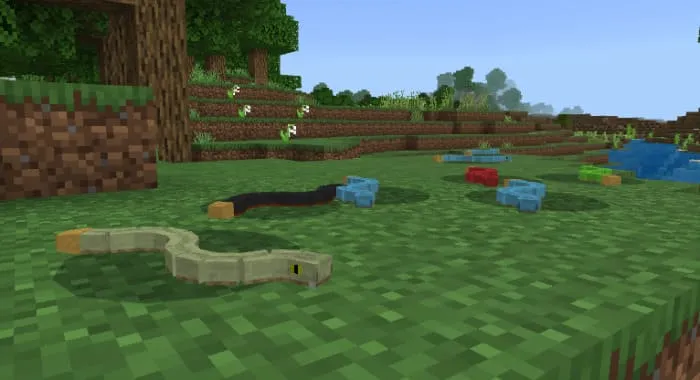

- **Biomes:** All biomes, especially grasslands and swamps
- **Health:** 12 HP
- **Damage:** 4
- **Behavior:** Slither around, aggressive
- **Drops:** Venom, scales
- **Special:** Venomous bite
- **Caution:** Can apply poison effect

### Coral Snake

- **Biomes:** Tropical swamps, rainforests
- **Health:** 14 HP
- **Damage:** 6 (highly venomous)
- **Behavior:** Solitary, aggressive
- **Drops:** Potent venom, scales
- **Special:** Very dangerous venom
- **Caution:** Deadly poison damage

---

## Aquatic Animals

These animals live primarily in water environments.

### Whale

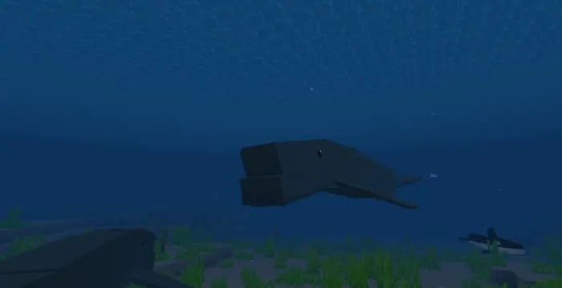

- **Biomes:** Ocean, deep water
- **Health:** 100 HP
- **Damage:** Passive (but dangerous when provoked)
- **Behavior:** Peaceful swimmers, breach occasionally
- **Drops:** Whale meat, blubber, bone
- **Special:** Largest animal in addon
- **Caution:** Killing a whale gives Bad Omen and Weakness for 1 hour!

### Orca (Killer Whale)

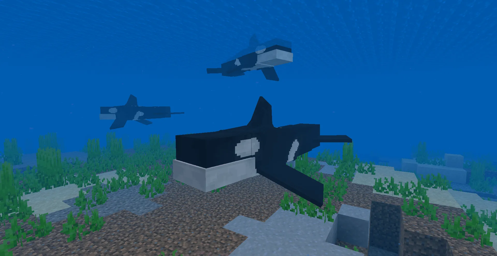

- **Biomes:** Cold ocean, arctic waters
- **Health:** 50 HP
- **Damage:** 9
- **Behavior:** Active hunters, intelligent
- **Drops:** Raw meat, blubber, bone
- **Special:** Apex predator of the ocean
- **Appearance:** Black and white coloring
- **Caution:** Dangerous predators

### Pink Dolphin

- **Biomes:** Tropical rivers, swamps, warm waters
- **Health:** 20 HP
- **Damage:** 4
- **Behavior:** Friendly and social
- **Drops:** Raw fish, bone
- **Special:** Unique pink coloring
- **Appearance:** Freshwater river dolphins

### Swordfish

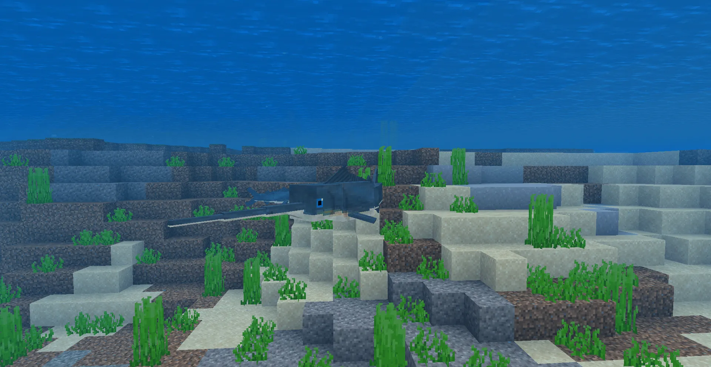

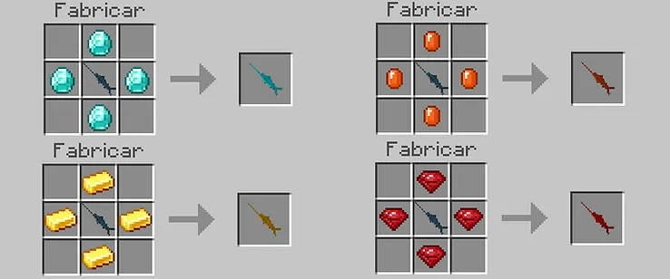

- **Biomes:** Ocean, warm waters
- **Health:** 28 HP
- **Damage:** 8
- **Behavior:** Aggressive hunters
- **Drops:** Raw swordfish, special sword materials
- **Special:** Can be crafted into upgraded weapons
- **Appearance:** Large predatory fish with sword-like bills

### Stingray

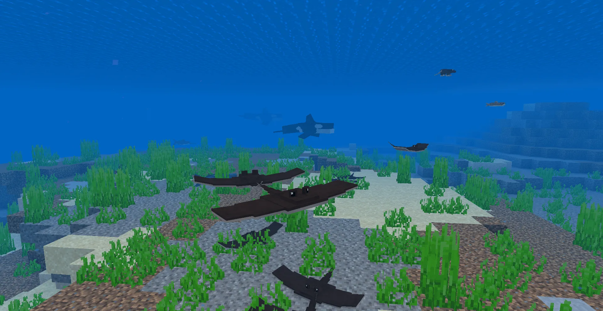

- **Biomes:** Ocean floor, tropical waters
- **Health:** 15 HP
- **Damage:** 6 (poisonous tail)
- **Behavior:** Glide along ocean floor
- **Drops:** Stingray hide, poison spine
- **Special:** Venomous sting
- **Appearance:** Flat rays with long tails

### Shrimp

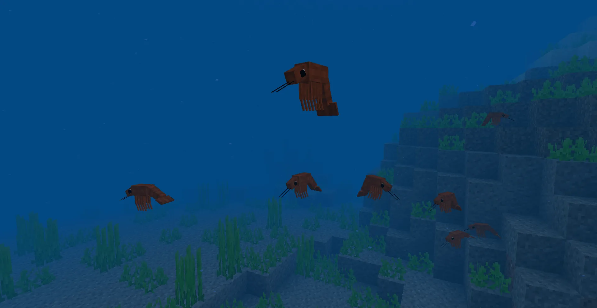

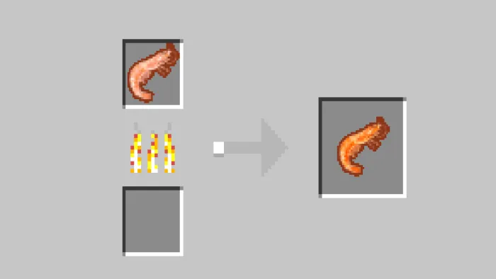

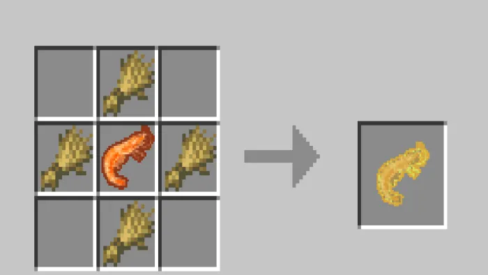

- **Biomes:** Ocean, coastal waters, reefs
- **Health:** 2 HP (fragile)
- **Damage:** 0 (passive)
- **Behavior:** Scavengers, peaceful
- **Drops:** Raw shrimp meat
- **Food:** Can be cooked or breaded into meals
- **Appearance:** Small crustaceans

### Crab

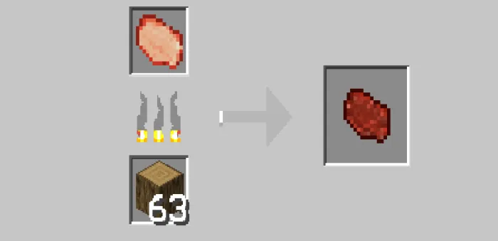

- **Biomes:** Beaches, coastal areas, reefs
- **Health:** 8 HP
- **Damage:** 3
- **Behavior:** Scuttle sideways, defensive
- **Drops:** Raw crab meat, shells
- **Food:** Can be cooked into food
- **Special:** Lateral movement
- **Appearance:** Hard-shelled crustaceans

### Clam

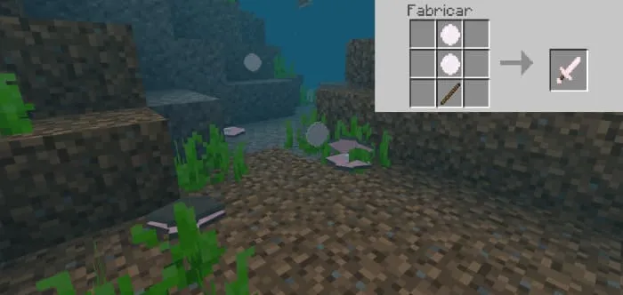

- **Biomes:** Ocean floor, reefs
- **Health:** 6 HP
- **Damage:** 0 (sessile)
- **Behavior:** Stay in place, filter feeders
- **Drops:** Pearls, meat
- **Special:** Pearls used for pearl sword crafting
- **Food:** Edible clam meat

### Jellyfish

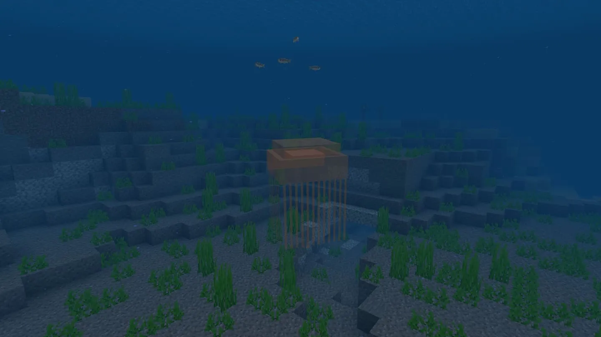

- **Biomes:** Ocean, all water biomes
- **Health:** 8 HP
- **Damage:** 3 (poison/sting)
- **Behavior:** Float passively, deadly to touch
- **Drops:** Jelly, poison sac
- **Special:** Lethal stinging tentacles
- **Caution:** Very dangerous despite slow movement

### Lantern Fish

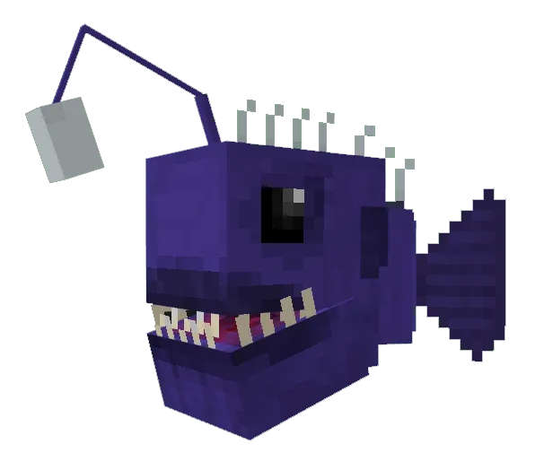

- **Biomes:** Deep ocean trenches, dark waters
- **Health:** 4 HP
- **Damage:** 0 (passive)
- **Behavior:** Bioluminescent, peaceful
- **Drops:** Raw fish, glowing essence
- **Food:** Edible fish meat
- **Special:** Eating lantern fish gives Night Vision for 150 seconds
- **Appearance:** Small glowing deep-sea fish

---

## Animal Drop Coordination

Some wild animals have special drop mechanics:

- **Stork & Pigeon:** Carry bags that drop upon death
- **Drowned Mobs:** Can spawn naturally with shark weapons
- **Whale:** Applies Bad Omen and Weakness status if killed
- **Lantern Fish:** Grants temporary Night Vision when eaten

---

[Back to Main Documentation](README.md)
