# Items & Crafting Guide

This comprehensive guide covers all custom items in the World Animals addon, organized by category with complete recipe information.

## Taming & Feeding

### Golden Bone

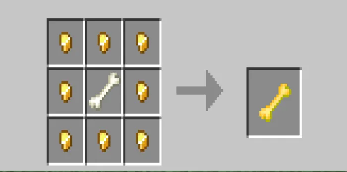

**Purpose:** Universal taming item for most animals

**Recipe:**
- 8 Gold Ingots (arrange in square border)
- 1 Bone (center)

**Result:** 1 Golden Bone

**Usage:** Right-click/interact with tameable animals to establish bond and enable riding

### Gold Bone Meal

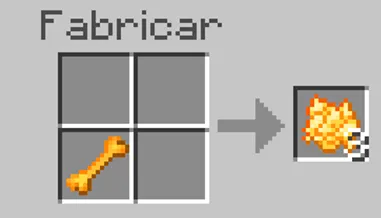

**Purpose:** Accelerate animal growth and egg hatching

**Recipe:**
- 9 Gold Nuggets (arrange in 3x3 square)

**Result:** 1 Gold Bone Meal

**Usage:**
- Right-click baby animals to speed up growth
- Right-click placed eggs to accelerate hatching

### Sugar Cube

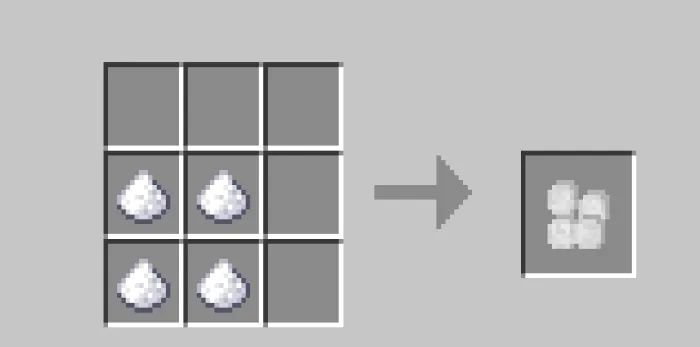

**Purpose:** Taming aid for elephants, special breeding food

**Recipe:**
- 9 Sugar (arrange in 3x3 square)

**Result:** 1 Sugar Cube

**Usage:**
- Use on Elephants for taming assistance
- Feed to Elephants for breeding

### Cheese

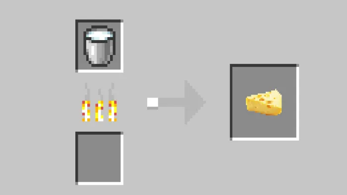

**Purpose:** Food for rats and taming aid

**Recipe:**
- 9 Milk Buckets (arrange in 3x3 square)

**Result:** 1 Cheese

**Usage:**
- Feed rats for breeding
- Use as special food item

---

## Saddles & Equipment

### Elephant Saddle

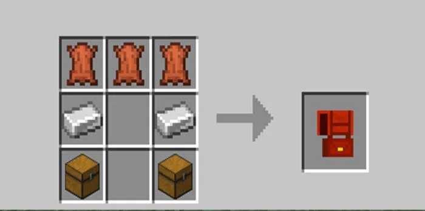

**Purpose:** Enables riding on Elephants and Mammoths

**Crafting Requires:**
- Leather
- Gold Ingots
- Saddle components

**Result:** Elephant Saddle

**Function:**
- Mount Elephants
- Control movement
- Store items in variant versions

### Big Cat Saddle

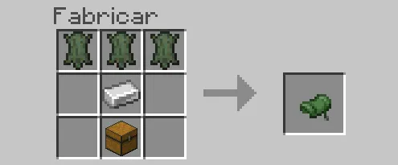

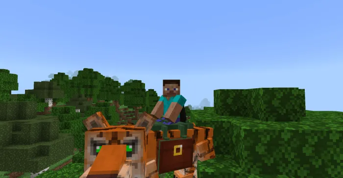

**Purpose:** Enables riding on all big cat species

**Compatible Animals:**
- Lion, White Lion
- Tiger, White Tiger
- Leopard, Snow Leopard
- Panther, Cougar

**Crafting Requires:**
- Leather
- Copper Ingots
- String

**Result:** Big Cat Saddle

**Function:** Mount and control big cats with precision steering

### Giraffe Saddle

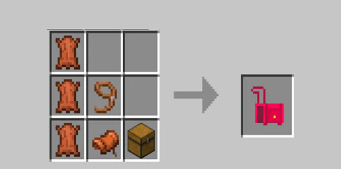

**Purpose:** Enables riding on Giraffes with built-in storage

**Crafting Requires:**
- Leather
- Gold Ingots
- Chest components

**Result:** Giraffe Saddle

**Special Feature:** Includes chest storage for inventory management while mounted

### Ostrich Saddle

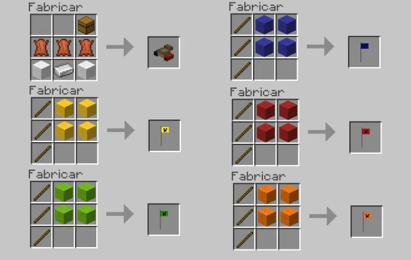

**Purpose:** Enables riding on Ostriches for fast travel

**Crafting Requires:**
- Leather
- Copper Ingots
- Feathers

**Result:** Ostrich Saddle

**Function:** Mount Ostriches and utilize their speed for fast travel

### Ostrich Flags

**Purpose:** Cosmetic decoration for Ostriches

**Available Colors:** 5 different flag colors

**Crafting:** Flags can be crafted from wool and dyes

**Function:** Purely cosmetic - adds visual flair to your Ostrich mount

---

## Armor Sets

### Elephant Armor

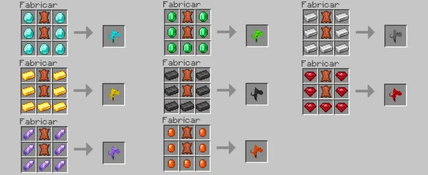

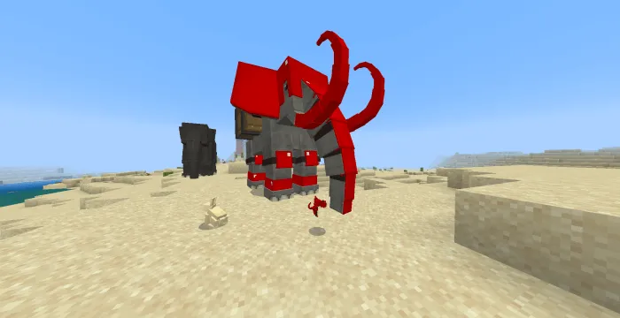

**Purpose:** Protective and cosmetic armor for Elephants

**Variants:** 9 different designs
- Leather armor
- Gold-trimmed designs
- Decorative patterned armor

**Crafting:** Combinations of leather, dyes, and gold ingots

**Function:** Protects mounted Elephants while adding visual customization

### Rhino Armor

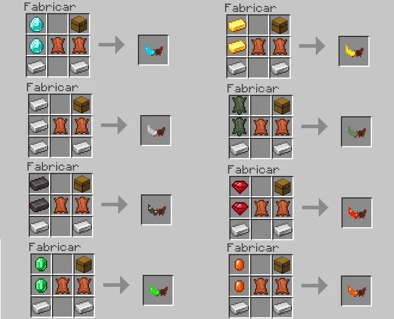

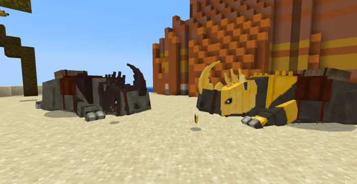

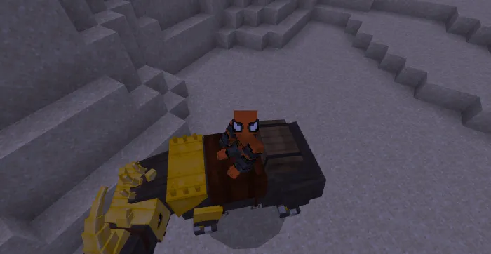

**Purpose:** Armor tiers that scale Rhino stats significantly

**Tier System:** 8 progressive armor tiers

| Tier | Material | Health Bonus | Damage Bonus | Use Case |
|------|----------|--------------|--------------|----------|
| 1 | Leather | +10 | +3 | Early game |
| 2 | Iron | +30 | +6 | Mid game |
| 3 | Gold | +50 | +9 | Adventure |
| 4 | Copper | +70 | +12 | Challenging |
| 5 | Netherite | +90 | +15 | Late game |
| 6 | Diamond | +110 | +18 | Endgame |
| 7 | Emerald | +130 | +20 | Elite |
| 8 | Platinum | +150 | +21 | Maximum |

**Function:** Stack multiple armor layers for maximum protection and damage output

### Reptile Armor Set

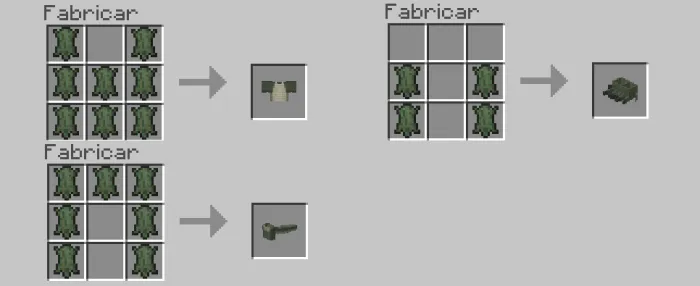

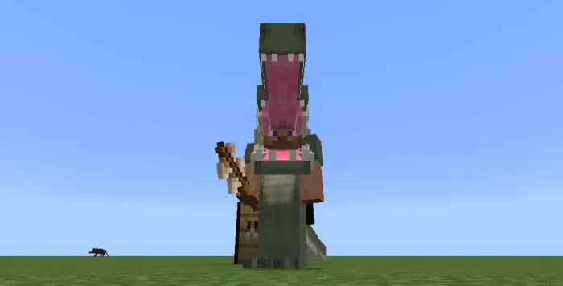

**Purpose:** Armor set wearable by players, crafted from reptile materials

**Crafting Requires:**
- Reptile Skin (dropped by reptiles)
- Copper Ingots
- Leather

**Result:** Full armor set (helmet, chestplate, leggings, boots)

**Function:**
- Wearable by players for protection
- Aesthetically themed around reptiles

### Ruby Armor Set

**Purpose:** Valuable armor crafted from Ruby ore

**Crafting Requires:**
- Ruby gemstones
- Gold Ingots
- Leather

**Components:**
- Helmet
- Chestplate
- Leggings
- Boots

**Function:** High-tier protective armor with valuable material theme

### Citrine Armor Set

**Purpose:** Valuable armor crafted from Citrine ore

**Crafting Requires:**
- Citrine gemstones
- Gold Ingots
- Leather

**Components:**
- Helmet
- Chestplate
- Leggings
- Boots

**Function:** High-tier protective armor with gemstone material theme

---

## Weapons & Tools

### Shark Sword

**Purpose:** Melee weapon crafted from shark teeth

**Crafting Requires:**
- Shark Teeth (dropped by sharks)
- Gold Ingots
- Sticks

**Result:** Shark Sword

**Properties:**
- High damage output
- Aquatic theme
- Rare material requirement

### Shark Spear

**Purpose:** Ranged/melee weapon from shark materials

**Crafting Requires:**
- Shark Teeth
- Copper Ingots
- String

**Result:** Shark Spear

**Properties:**
- Extended reach weapon
- Aquatic theme
- Throwable mechanics

### Feline Knife

**Purpose:** Melee weapon crafted from big cat materials

**Crafting Requires:**
- Feline Teeth (dropped by big cats)
- Copper Ingots
- Sticks

**Result:** Feline Knife

**Properties:**
- Swift attacks
- Jungle/savanna theme
- Medium damage

### Pearl Sword

**Purpose:** Elegant sword crafted from pearls

**Crafting Requires:**
- Pearls (dropped by clams)
- Gold Ingots
- Sticks

**Result:** Pearl Sword

**Properties:**
- Aquatic aesthetic
- Elegant appearance
- Medium-high damage

### Swordfish Upgrades

**Purpose:** Upgrade materials from Swordfish catches

**Drops from:** Swordfish creatures

**Usage:**
- Craft into enhanced weapons
- Combine with existing weapons for upgrades
- Material for specialized recipes

### Ruby Tools

**Purpose:** High-tier pickaxe, axe, shovel, and hoe set

**Crafted from:**
- Ruby gemstones
- Sticks
- Gold Ingots

**Components:**
- Pickaxe (mining)
- Axe (wood harvesting)
- Shovel (digging)
- Hoe (farming)

**Properties:** Durable, high mining speed

### Citrine Tools

**Purpose:** High-tier pickaxe, axe, shovel, and hoe set

**Crafted from:**
- Citrine gemstones
- Sticks
- Gold Ingots

**Components:**
- Pickaxe (mining)
- Axe (wood harvesting)
- Shovel (digging)
- Hoe (farming)

**Properties:** Durable, high mining speed

---

## Food Items

### Raw Ostrich Leg

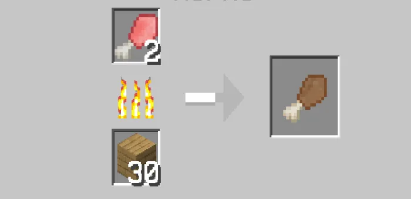

**Source:** Dropped by Ostriches when defeated

**Usage:**
- Eat raw for food (restores hunger)
- Cook into Cooked Ostrich Leg for better nutrition

**Nutrition:** Moderate hunger restoration

### Cooked Ostrich Leg

**Source:** Cook Raw Ostrich Leg in furnace

**Recipe:** Smelt raw ostrich leg in furnace

**Result:** Cooked Ostrich Leg

**Nutrition:** High hunger restoration + saturation

### Raw Duck

**Source:** Dropped by Ducks when defeated

**Usage:**
- Eat raw for food
- Cook for improved nutrition

**Nutrition:** Moderate hunger restoration

### Cooked Duck

**Source:** Cook Raw Duck in furnace

**Nutrition:** High hunger restoration + saturation

### Raw Rat

**Source:** Dropped by Rats when defeated

**Usage:**
- Eat raw (not recommended)
- Cook into Cooked Rat
- Craft into Rat Taco

### Cooked Rat

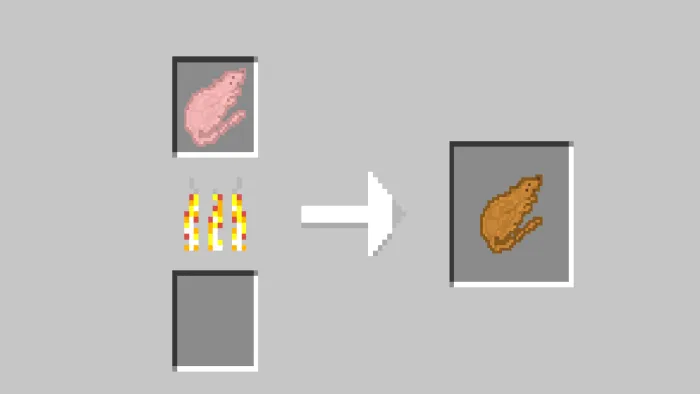

**Source:** Cook Raw Rat in furnace

**Nutrition:** Moderate hunger restoration + saturation

### Rat Taco

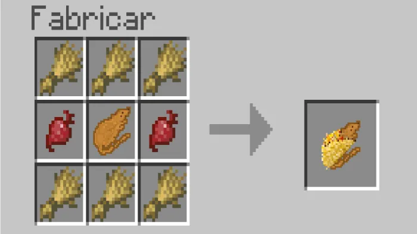

**Purpose:** Unique food item from rats and tortillas

**Recipe:**
- Cooked Rat
- Tortilla shell
- Lettuce/vegetables

**Nutrition:** High hunger restoration with special effects

### Raw Crab

**Source:** Dropped by Crabs when defeated

**Nutrition:** Minimal hunger restoration

### Cooked Crab

**Source:** Cook Raw Crab in furnace

**Nutrition:** Good hunger restoration + saturation

### Raw Shrimp

**Source:** Dropped by Shrimp when defeated

**Nutrition:** Minimal hunger restoration

### Cooked Shrimp

**Source:** Cook Raw Shrimp in furnace

**Nutrition:** Good hunger restoration + saturation

### Breaded Shrimp

**Purpose:** Enhanced shrimp dish

**Recipe:**
- Cooked Shrimp
- Breadcrumbs
- Seasonings

**Nutrition:** Excellent hunger restoration + saturation

### Cooked Turkey Block

**Purpose:** Decorative/consumable cooked turkey

**Source:** Crafted from turkey meat

**Function:** Functional food item displayed as block

### Lantern Fish

**Purpose:** Special deep-sea fish with unique effect

**Effect:** Grants **Night Vision** for 150 seconds when eaten

**Source:** Dropped by Lantern Fish creatures

**Usage:** Eat to activate night vision effect temporarily

---

## Cosmetic Items

### Scarves

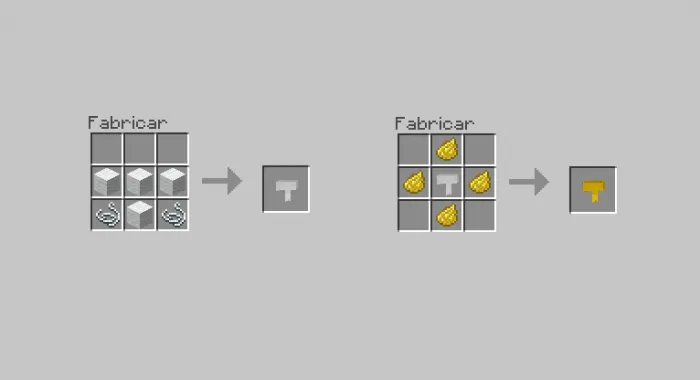

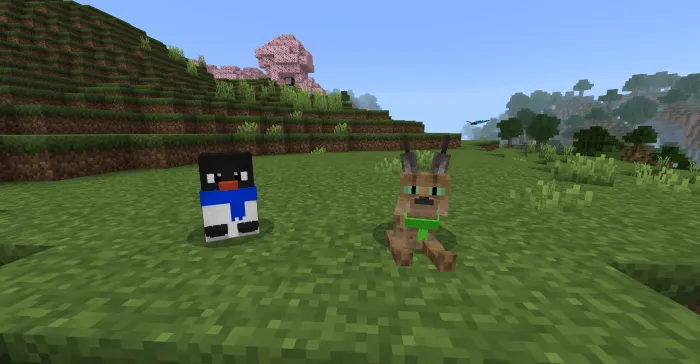

**Purpose:** Decorative cosmetic items for animals

**Available Colors:** 16 different colors

**Compatible Animals:**
- Penguins (4 variants)
- Caracals
- Seals
- Red Pandas
- Raccoons
- Chimpanzees (alternative to astronaut suits)

**Crafting:** Wool + dyes

**Function:** Purely cosmetic - adds personality to your companions

### Chimpanzee Astronaut Suits

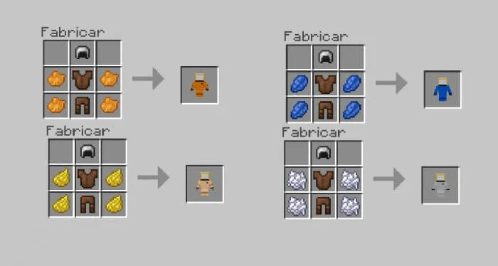

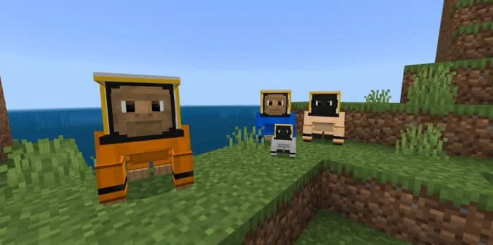

**Purpose:** Unique cosmetic suits for Chimpanzees

**Available Colors:** 4 different suit colors

**Crafting Requires:**
- Wool (base color)
- Dyes
- Leather
- Iron Ingots (helmet visor)

**Function:** Transforms Chimpanzees into space explorers for fun cosmetic effect

### Butterfly Elytra

**Purpose:** Decorative elytra variants from butterfly wings

**Available Colors:** 5 color variants

**Crafting Requires:**
- Butterfly Wings (dropped by butterflies)
- Leather
- String

**Function:** Wearable elytra with butterfly aesthetic for gliding

### Flags

**Purpose:** Decorative flags for Ostriches

**Available Colors:** 5 colors

**Crafting:** Wool + sticks + dyes

**Function:** Cosmetic decoration that equips on Ostriches

### Hat

**Purpose:** Wearable hat for small animals

**Compatible Animals:**
- Hedgehogs
- Platypuses

**Crafting:** Wool + leather

**Function:** Cosmetic accessory for adorable creatures

### Zebra Carpet

**Purpose:** Decorative floor block from zebra materials

**Crafting Requires:**
- Zebra Skin (dropped by zebras)
- Carpet base materials

**Function:** Decorative block for building and design

### Zebra Sofa

**Purpose:** Decorative seating furniture from zebra materials

**Crafting Requires:**
- Zebra Skin
- Wooden sticks
- Leather

**Function:** Decorative furniture block for building

---

## Raw Materials & Resources

### Ruby

**Source:** Ruby Ore (found underground)

**Usage:**
- Craft into Ruby Armor set
- Craft Ruby tools (pickaxe, axe, shovel, hoe)
- Valuable trade item

**Properties:** Gem material, high value

### Citrine

**Source:** Citrine Ore (found underground)

**Usage:**
- Craft into Citrine Armor set
- Craft Citrine tools (pickaxe, axe, shovel, hoe)
- Valuable trade item

**Properties:** Gem material, high value

### Reptile Skin

**Source:** Dropped by reptiles (crocodiles, snakes, iguanas, etc.)

**Usage:**
- Craft Reptile Armor set
- Armor decoration
- Trade material

### Shark Tooth

**Source:** Dropped by sharks (all three variants)

**Usage:**
- Craft Shark Sword
- Craft Shark Spear
- Trade material

### Pearl

**Source:** Dropped by clams and oysters

**Usage:**
- Craft Pearl Sword
- Jewelry crafting
- Valuable trade item

### Zebra Skin

**Source:** Dropped by zebras

**Usage:**
- Craft Zebra Carpet
- Craft Zebra Sofa
- Decorative material

### Feline Tooth

**Source:** Dropped by big cats (lions, tigers, leopards, etc.)

**Usage:**
- Craft Feline Knife
- Jewelry items
- Trade material

### Elephant/Mammoth DNA

**Source:** Dropped by elephants and mammoths

**Usage:**
- Combine with Syringe to transform elephants
- Craft DNA-based items
- Research material

### Syringe

**Source:** Crafted from glass and needles

**Usage:**
- Combine with Elephant DNA to transform elephants into mammoths
- Medical item crafting

---

## Crafting Tips

- **Organization:** Group materials by source for efficient gathering
- **Batch Crafting:** Make multiple tools/armor sets while you have materials
- **Trading:** Special NPCs (Safari Villager, Ice Villager) may trade for rare items
- **Enchanting:** Armor and tools can be enchanted for better performance
- **Durability:** Higher-tier items last longer and perform better
- **Alternative Uses:** Some items work for multiple purposes (e.g., leather for armor and saddles)

---

[Back to Main Documentation](README.md)
