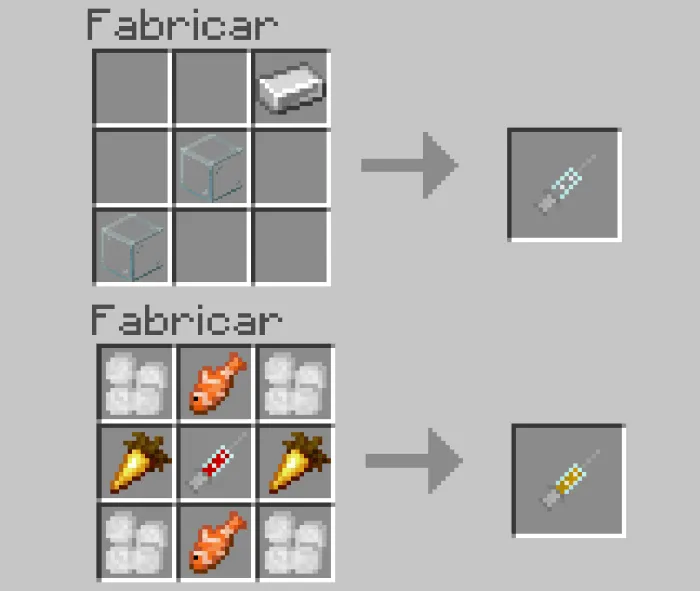

# Special Mechanics

This page covers advanced and unique mechanics in the World Animals addon that add depth and special interactions to gameplay.

## DNA Transformation System

### Overview

The DNA/Syringe system allows transformation of certain animals into new forms, with the primary example being Elephant to Mammoth transformation.

### Elephant to Mammoth Transformation

**Purpose:** Transform a tamed Elephant into a more powerful Mammoth

**Requirements:**
- 1 Tamed Elephant
- 1 DNA Syringe
- Elephant DNA (obtained from elephants)

**Recipe:** DNA Syringe crafted from glass components and needles

**Mammoth DNA Recipe:**

**Transformation Process:**

1. **Obtain DNA Materials:**
   - Hunt elephants to collect Elephant DNA drops
   - Craft DNA Syringe from glass and needles
   - Combine DNA with Syringe to create Elephant DNA Syringe

2. **Use on Tamed Elephant:**
   - Right-click your tamed Elephant with DNA Syringe
   - Confirm the transformation
   - Elephant becomes Mammoth

3. **Result:**
   - Health increases from 80 HP to 150 HP
   - Damage increases from 12 to 20
   - New appearance and abilities
   - Biome preference changes to snow/cold areas
   - Drops change to Mammoth DNA instead

### Mammoth Advantages

- **Higher Health:** 150 HP vs Elephant's 80 HP
- **Increased Damage:** 20 vs Elephant's 12
- **Arctic Adaptation:** Better suited for cold biomes
- **Enhanced Armor:** Thicker protective appearance
- **New Drops:** Mammoth DNA, different materials

### Reverse Transformation

DNA transformation is generally permanent, but future updates may include reverse mechanics.

---

## Butterfly Wings

### How to Get Butterfly Wings

- Defeat butterflies found in flowery biomes
- Butterflies drop wings that can be used as cosmetic elytra reskins

### Using Butterfly Wings

Butterfly wings are cosmetic items that change the appearance of your elytra. Equip them alongside your elytra to apply the butterfly wing design.

**Available Colors:**
- Purple Butterfly Wings
- Orange Butterfly Wings
- Teal Butterfly Wings
- Magenta Butterfly Wings
- Red Butterfly Wings

The wings do not replace the elytra — they are a visual overlay that changes how it looks while gliding.

---

## Whale Consequence System

### Whale Special Mechanic

**Important Warning:** Killing a Whale has severe consequences!

**Consequence:** Killing a Whale grants the player:
- **Bad Omen Status** (for 1 hour)
- **Weakness Status** (for 1 hour)

### Bad Omen Effect

**Duration:** 60 minutes (game time)

**Results:**
- Approaching villages triggers Raid events
- More difficult combat situations
- Increased hostile mob spawning
- Village-based consequences

### Weakness Effect

**Duration:** 60 minutes

**Results:**
- Reduced damage dealt by player
- Combat becomes significantly harder
- Healing is less effective
- Melee attacks do 0.5x damage

### Strategic Implications

- **Respect Wildlife:** Whales are large, peaceful creatures
- **Consequence Planning:** Prepare defenses before confrontation
- **Avoid Farming:** Not recommended to repeatedly kill whales
- **Role-playing:** Creates narrative consequence to actions

### Reversing Effects

- **Wait it out:** Effects last 1 hour, then wear off naturally
- **Milk:** Drink milk buckets to cleanse bad omen (Bad Omen only)
- **Avoid Villages:** Stay away from settlements while affected
- **Prepare Combat:** Enhance armor and weapons before effect wears

---

## Stork & Pigeon Bag Drops

### Special Mechanic

Storks and Pigeons carry bags that drop upon defeat.

### Bag Contents

**Drop Coordination:**
- Bags contain special items
- Materials vary by bird type
- Useful crafting ingredients
- Valuable trade goods

**Stork Bags:**
- Contains feathers (high-quality)
- Bird-related crafting materials
- Specialized ingredients
- Rare dyes and colors

**Pigeon Bags:**
- Mixed crafting materials
- Urban-gathered items
- Message-delivery themed items
- Various useful components

### Collection Strategy

1. **Locate birds** in their natural habitats
2. **Defeat birds** to trigger bag drop
3. **Collect bags** from the ground
4. **Open/craft** contents into final items
5. **Use materials** for various recipes

### Practical Uses

- **Crafting:** Bags contain pre-curated material sets
- **Trading:** Bags sell well to NPCs
- **Efficiency:** Structured drops reduce farming time
- **Discovery:** Some unique items only in bags

---

## Crocodile White Variant

### Rare Color Variant

**Base Animal:** Crocodile

**Rarity:** 10% chance to spawn as white variant

### White Crocodile Features

- **Appearance:** Bright white scales instead of green
- **Stats:** Identical to normal crocodiles
- **Behavior:** Same aggression and patterns
- **Rarity:** Uncommon encounter

### White Variant Properties

- **Health:** 30 HP (same as green)
- **Damage:** 8 (same as green)
- **Biome:** Same as normal crocodiles
- **Drops:** Same materials as normal crocodiles
- **Collectibility:** Visually distinctive

### Hunting White Crocodiles

- **Specific Search:** Target swamp and tropical areas
- **Patience Required:** 10% chance means many encounters
- **Collection:** For aesthetic purposes
- **Breeding:** White variants may breed true

---

## Lantern Fish Night Vision Effect

### Deep-Sea Specialty

**Animal:** Lantern Fish (bioluminescent deep-sea fish)

**Unique Property:** Eating Lantern Fish grants Night Vision buff

### Night Vision Effect

**Duration:** 150 seconds (2.5 minutes)

**Mechanics:**
- Automatically granted upon eating Lantern Fish
- Works like standard Minecraft Night Vision
- Vision enhancement in dark environments
- Stacks with other night vision sources

### Practical Applications

- **Cave Exploration:** Navigate dark areas without torches
- **Night Travel:** Explore safely after sunset
- **Underwater Exploration:** See clearly underwater
- **Emergency Lighting:** Quick alternative to torches

### Obtaining Lantern Fish

**Source:** Deep ocean biomes (dark waters)

**Hunting:**
1. Dive to deep ocean trenches
2. Look for bioluminescent glow
3. Collect lantern fish with fishing or combat
4. Cook or eat raw

**Preparation:**
- Bring armor for underwater combat
- Use water breathing potions
- Bring food/healing items
- Prepare for deep-sea creatures

### Efficiency Notes

- **Effect Duration:** 150 seconds is 2.5 minutes
- **Reapplication:** Eat multiple fish for extended night vision
- **Storage:** Lantern fish can be stored in barrels
- **Renewable:** Unlimited fishing from ocean

---

## Animal Interaction Mechanics

### Taming Success Indicators

**Visual Feedback:**
- Heart particles = taming in progress
- Color changes = animal state changes
- Sound effects = confirmation sounds
- Behavior changes = acceptance of rider

### Breeding Success Indicators

**Visual Feedback:**
- Hearts around animals = breeding mode
- Particle effects = successful mating
- Baby spawn = confirmation
- Growth progression = clear age markers

### Riding Mechanics

**Mount Controls:**
- WASD/Analog stick = movement direction
- Jump = animal jumping capability
- Sprint = horse/animal speed boost
- Interact = mount/dismount

**Passenger Features:**
- Can attack while mounted (some animals)
- Limited reach due to mount positioning
- Can use items while mounted
- View direction independent of movement

### Equipment Interaction

**Armor Application:**
- Right-click animal with armor
- Armor visibly equips
- Protection applies automatically
- Multiple armor layers possible (rhinos)

**Saddle Application:**
- Required for riding
- Applied once, persists
- Can be switched with new saddles
- Provides mounting functionality

**Cosmetic Equipment:**
- Scarves, hats, flags are visual-only
- Non-protective cosmetics
- Can be swapped freely
- Multiple colors available

---

## Special Behavior Mechanics

### Herd Behavior

**Animals with Herd Mechanics:**
- Zebras (travel in groups)
- Elephants (protective of babies)
- Buffalo (group grazing)
- Deer (flee together)
- Kangaroos (bounded movement)

**Implications:**
- Animals spawn in groups
- Defensive behavior when threatened
- Breeding creates family units
- Baby protection by parents

### Nesting/Egg-Laying

**Animals that Lay Eggs:**
- Ostriches (naturally)
- Ducks (naturally)
- Penguins (natural breeding)
- Platypus (egg-layer)

**Egg Properties:**
- Placed on solid ground
- Hatch over time naturally
- Accelerated with Gold Bone Meal
- Breakable and fragile

### Nocturnal Behavior

**Nocturnal Animals:**
- Raccoons (active at night)
- Fireflies (glow at night)
- Snakes (more active at night)
- Owls (if included)

**Gameplay Impact:**
- May be harder to find during day
- More visible at night
- Different loot drops
- Behavioral changes by time

### Aquatic Adaptation

**Full Aquatic Animals:**
- Sharks, Dolphins, Whales
- Fish varieties
- Jellyfish, Stingrays
- Aquatic reptiles

**Semi-Aquatic Animals:**
- Crocodiles (hunt in water)
- Hippos (water-dwelling)
- Seals (swimming mammals)
- Penguins (swimming birds)

**Water Mechanics:**
- Breathing underwater (if applicable)
- Swimming speed variations
- Depth preferences
- Hunting in water

---

## Status Effect Interactions

### Poison/Venom Effects

**Animals with Poison:**
- Komodo Dragons
- Jellyfish
- Snakes
- Stingrays
- Scarlet Kingsnakes

**Poison Mechanics:**
- Applied on successful hit
- Damage over time effect
- Antidote: Milk buckets
- Prevention: Armor/potions

### Other Status Effects

**Bad Omen (from Whale killing):**
- Triggers raids in villages
- Duration: 1 hour
- Effect: Increased raid events

**Weakness (from Whale killing):**
- Reduced damage output
- Healing less effective
- Duration: 1 hour
- Prevention: Avoid whale combat

**Night Vision (from Lantern Fish):**
- Vision enhancement
- Underwater clarity
- Duration: 150 seconds
- No harmful effects

---

## Advanced Farming Strategies

### Animal Breeding Farm

1. **Setup:** Enclosed area with tamed animal pairs
2. **Feeding:** Supply preferred foods regularly
3. **Breeding:** Feed animals to trigger breeding
4. **Growth:** Use Gold Bone Meal to speed aging
5. **Harvesting:** Collect drops from mature animals

### Egg Incubation Farm

1. **Collection:** Gather eggs from laying animals
2. **Placement:** Arrange eggs in farming area
3. **Acceleration:** Use Gold Bone Meal liberally
4. **Hatching:** Babies spawn when ready
5. **Organization:** Separate by age/species

### Omnivore Optimization

Animals with diverse diets:
- More flexible breeding (use available food)
- Easier to maintain farms
- Faster reproduction cycles
- Resource efficiency

---

[Back to Main Documentation](README.md)
