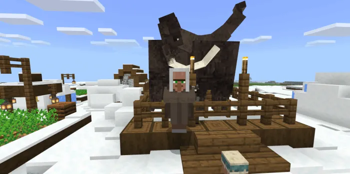

# World Generation

The World Animals addon adds unique world generation features including new ores, special trees, plants, and NPCs that enhance the Minecraft landscape.

## Ore Generation

### Ruby Ore

**Appearance:** Red gem ore blocks

**Generation:**
- Found underground in all biomes
- Spawn depth: Varies by Minecraft version (typically Y-level 0-64)
- Vein size: 8-block veins
- Frequency: Common spawning rate

**Variants:**
- Ruby Ore (standard stone)
- Deepslate Ruby Ore (deep underground in deepslate)

**Harvesting:**
- Requires pickaxe (Iron or better)
- Drops Ruby gemstone
- Fortune enchantment increases drops

**Usage:**
- Craft Ruby Armor set
- Craft Ruby tools (pickaxe, axe, shovel, hoe)
- Valuable trading material with villagers

### Citrine Ore

**Appearance:** Yellow/golden gem ore blocks

**Generation:**
- Found underground in all biomes
- Spawn depth: Varies by Minecraft version
- Vein size: 8-block veins
- Frequency: Common spawning rate

**Variants:**
- Citrine Ore (standard stone)
- Deepslate Citrine Ore (deep underground in deepslate)

**Harvesting:**
- Requires pickaxe (Iron or better)
- Drops Citrine gemstone
- Fortune enchantment increases drops

**Usage:**
- Craft Citrine Armor set
- Craft Citrine tools (pickaxe, axe, shovel, hoe)
- Valuable trading material with villagers

### Mining Strategy

1. **Early Game:** Mine at Y-level 16-32 for safer ore finding
2. **Mid Game:** Expand to deeper levels (Y 0-16) for more ore
3. **Late Game:** Branch mining for maximum efficiency
4. **Enchantments:** Use Fortune III pickaxes for increased drops
5. **Strip Mining:** Effective horizontal mining at ore level

---

## Trees & Plants

### Palm Trees

**Appearance:** Distinctive tropical trees with coconut-like fruits

**Generation:**
- Jungle biomes
- Desert biomes
- Beach/coastal areas
- Tropical regions

**Characteristics:**
- Tall trunk
- Spread canopy
- Natural fruit-bearing (coconuts, dates)

**Resources:**
- Logs (similar to oak logs)
- Leaves (similar to jungle leaves)
- Tropical fruits (unique food items)

**Usage:**
- Build tropical-themed structures
- Gather wood
- Collect tropical fruits
- Decoration and landscaping

### Banana Clusters

**Appearance:** Bunches of bananas on trees

**Generation:**
- Jungle biomes (primary location)
- Tropical rainforests
- Found as part of vegetation

**Characteristics:**
- Grow naturally on trees
- Multiple bananas per cluster
- Yellow fruit appearance

**Harvesting:**
- Break clusters to collect individual bananas
- Hand-harvest without tools

**Usage:**
- Feed to monkeys (Chimpanzees, Capuchins)
- Food for herbivorous animals
- Breeding food for tropical animals
- Tropical food ingredient

---

## Special Structures & NPCs

### Safari Villager

**Location:** Savanna and jungle biomes

**Appearance:** Unique villager with safari outfit and equipment

**Trading:**
- Sells specialized animal items
- Buys rare animal materials
- Offers unique recipes and crafting items
- Provides taming-related equipment

**Item Trades:**
- May trade Golden Bones
- Offers saddle variations
- Exchanges animal materials
- Special item access

**Profession:** Zoologist/Animal Specialist

**Finding Tips:**
- Search open savannas and jungle clearings
- Look for natural villages
- Check near animal spawn areas
- More common in generated settlements

### Ice Villager

**Location:** Snow biomes and cold regions

**Appearance:** Unique villager with cold-weather clothing

**Trading:**
- Specializes in arctic/mammalian items
- Trades with Mammoths and arctic animals
- Offers cold-weather equipment
- Arctic material exchange

**Item Trades:**
- Mammoth-related items
- Arctic animal equipment
- Cold-weather gear
- Rare northern materials

**Profession:** Arctic Specialist/Mammoth Handler

**Finding Tips:**
- Search snowy plains and mountains
- Look in snow biomes for villages
- Check glacier formations
- Often appears near Mammoth habitats
- Spawns naturally with Mammoths in snow biomes

**Specialization:**
- Mammoth taming and breeding
- Arctic animal materials
- Cold-biome exclusive items
- Snow-themed cosmetics

---

## Biome-Specific Generation

### Desert Biomes
- Palm Trees
- Ruby/Citrine Ore
- Ostriches, Camels
- Sand-dwelling creatures

### Jungle Biomes
- Banana clusters
- Palm Trees
- Gorillas, Monkeys
- Tropical animals
- Dense vegetation

### Savanna Biomes
- Safari Villagers
- Elephants, Giraffes
- Zebras, Lions
- Grassland herbivores
- Open terrain

### Snow Biomes
- Ice Villagers
- Mammoths, Seals
- Penguins
- Arctic animals
- Ice structures

### Forest Biomes
- Standard trees
- Deer, Bears
- Squirrels, Raccoons
- Woodland creatures
- Dense vegetation

### Ocean Biomes
- Sharks, Dolphins
- Whales, Orcas
- Aquatic animals
- Coral structures
- Reef systems

### River/Water Biomes
- Pink Dolphins
- Crocodiles, Hippos
- Aquatic animals
- Water plants

### Mountain Biomes
- Rare animal spawns
- Ore deposits (Ruby/Citrine)
- Snow-adapted animals
- High-altitude creatures

---

## World Configuration

### Spawn Rates

Animal spawning is balanced to maintain:
- **Peaceful play** with passive animal abundance
- **Challenging gameplay** with predator presence
- **Biome variety** with region-specific creatures
- **Performance** with optimization for lower-end devices

### Difficulty Settings Impact

- **Peaceful:** Herbivores and harmless animals only
- **Easy:** Reduced hostile animal spawns
- **Normal:** Balanced animal distribution
- **Hard:** Increased hostile animal spawns, more aggressive behavior

---

## Finding Specific Animals

### Strategy for Different Biomes

**Desert & Savanna:**
1. Travel during day for visibility
2. Look for herds (Zebras, Elephants, Giraffes)
3. Search open plains
4. Follow water sources for gathering spots

**Jungle:**
1. Use cleared paths for navigation
2. Listen for vocalizations
3. Search canopy areas
4. Look for feeding grounds

**Snow:**
1. Look for Mammoths and Arctic animals
2. Check frozen lakes and rivers
3. Search cold plains
4. Find Ice Villager settlements

**Ocean:**
1. Swim in deeper waters
2. Avoid surface reefs initially
3. Look for whale migrations
4. Search tropical waters for dolphins

**Forest:**
1. Navigate carefully (dense trees)
2. Look for animal trails
3. Check clearings and meadows
4. Search near water sources

---

## Resource Gathering Efficiency

### Ore Mining
- Fortune III pickaxe: 1.5x-2x more drops
- Full set coverage for maximum yield
- Target Y-levels 0-32 for best rates

### Tree Harvesting
- Palm Trees in tropical biomes (quickest tropical wood)
- Multiple fruit harvests per tree
- Efficient branch mining of logs

### Plant Collection
- Bananas respawn after harvest
- Multiple sources per biome
- Gathering tools speed collection

### Animal Material Farming
- Breed animals for renewable drops
- Harvest materials from wild animals
- Trade with villagers for rare items

---

[Back to Main Documentation](README.md)
